# Unity Catalog Governance Tagging Study Guide

This document explains the implementation under
`src/databricks/labs/sdp_meta/governance/tagging`.

The package is an ownership-aware Unity Catalog tag reconciler. It compares
desired table and column tags in `tags.yml` with Unity Catalog metadata, plans
safe changes, applies tag SQL, verifies the result, and records ownership in a
Delta state table.

The applier works with any Unity Catalog table, including tables not created by
SDP-META. Only the optional target generator is SDP-META-specific.

## High-level architecture


## Package structure

- `models.py` defines assignment keys, desired values, ownership, and actions.
- `config.py` loads and validates `tags.yml`.
- `generator.py` creates safe starter configuration from SDP-META onboarding.
- `backends.py` executes SQL and reads Unity Catalog metadata.
- `planner.py` calculates ownership-aware reconciliation actions.
- `tag_sql_renderer.py` renders tag actions as deterministic SQL.
- `state.py` reads and writes the Delta ownership table.
- `applier.py` coordinates validation, planning, execution, and verification.

Tests are under `tests/governance/tagging`.

## Configuration model

One file manages one catalog and may contain tables from multiple schemas.

```yaml
version: "1"
source_id: retail-production-tags

defaults:
  catalog: main_prod
  schema: retail

tables:
  customers:
    table:
      data_domain: customer
      access_tier: restricted
    columns:
      email:
        sensitivity: pii

  reporting.orders:
    table:
      data_domain: sales
```

### Target resolution

Target names support three forms:

```text
customers
  -> defaults.catalog + defaults.schema + customers

reporting.orders
  -> defaults.catalog + reporting + orders

main_prod.reporting.orders
  -> fully qualified target
```

Every resolved target must belong to the effective catalog.

### Source identity

`source_id` identifies the configuration owner. Each selected table contributes
an identity shaped like:

```text
("target", source_id, "catalog.schema.table")
```

For example:

```text
("target", "retail-production-tags", "main_prod.retail.customers")
```

This allows multiple configuration files to share a tag assignment without
removing one another's ownership.

### Empty target behavior

An active empty target is an intentional cleanup request:

```yaml
tables:
  customers: {}
```

It means that `customers` remains in this source's reconciliation scope, but
this source currently desires no tags for it. Previously owned assignments may
therefore be removed.

Removing `customers` from the file entirely puts it outside the current run's
scope.

## Data models

### `Key`

`Key` identifies one tag assignment:

```text
catalog
schema
table
column or None
tag_key
```

Examples:

```text
main.retail.customers :: data_domain
main.retail.customers.email :: sensitivity
```

A table tag has `column=None`. A column tag includes a column name.

### `Desired`

`Desired` stores:

- the desired string value;
- the contributor identities requesting that assignment.

Multiple contributors may request the same value.

### `Action`

The planner produces `Action` objects:

- `set` applies or updates a tag;
- `unset` removes a script-owned stale tag;
- `conflict` reports a change that requires review;
- `noop` records that the desired and actual values already match;
- `record_external` observes a matching pre-existing tag;
- `forget` removes an ownership-state observation without removing the UC tag;
- `update_contributors` changes shared ownership without changing the UC tag.

Ownership values are:

- `script`: the applier may manage the assignment;
- `external`: the applier observes and preserves the assignment.

## Configuration loading

`config.py` performs strict validation before metadata reads or mutation.

It checks:

- `version` is `"1"`;
- `source_id` is present and valid;
- duplicate YAML keys are rejected;
- only supported root and target nodes are used;
- catalog, schema, table, and column identifiers are valid;
- tag keys and values meet length and character requirements;
- per-object and per-table tag limits are respected;
- every target resolves into the file's effective catalog.

The configuration is expanded into:

```text
desired assignments
selected contributors
selected tables
```

## SDP-META target generator

`generator.py` discovers physical targets from environment-resolved SDP-META
onboarding YAML or JSON.

It examines:

- bronze main targets;
- bronze quarantine targets;
- silver main targets;
- silver quarantine targets.

Example command:

```bash
databricks labs sdp-meta generate-tags \
  --input onboarding.prod.yml \
  --output tags.generated.yml \
  --environment prod \
  --catalog main_prod \
  --schema retail \
  --source-id retail-production-tags
```

Generated targets remain comments:

```yaml
version: "1"
source_id: retail-production-tags

defaults:
  catalog: main_prod
  schema: retail

tables: {}

# Discovered targets remain inactive until desired tags are added.
#   customers:
#     table:
#       <tag-key>: <tag-value>
```

This prevents generated scaffolding from becoming an accidental cleanup
request. The generator does not infer classifications or inspect table data.

## SQL backends and metadata

`backends.py` supports:

1. Spark SQL when an active Spark session exists.
2. Databricks SQL Statement Execution when `--warehouse-id` is supplied.

The package reads:

- `information_schema.tables`;
- `information_schema.columns`;
- `information_schema.table_tags`;
- `information_schema.column_tags`.

Before planning, preflight verifies that every configured table and desired
column exists and is accessible.

## Reconciliation planner

`planner.py` is a pure function. It does not execute SQL or mutate state.

Conceptually it receives:

```python
plan(
    desired,
    actual,
    state,
    transfer,
    selected_contributors,
)
```

### Missing desired assignment

```text
Desired: sensitivity=pii
Actual: absent
```

Result:

```text
set
```

### Matching assignment without state

```text
Desired: sensitivity=pii
Actual: sensitivity=pii
State: absent
```

Result:

```text
record_external
```

Because the applier did not create the assignment, it records it as externally
owned.

### Script-owned value update

```text
Last applied: sensitivity=pii
Desired: sensitivity=restricted
Actual: sensitivity=pii
```

Result:

```text
set
```

### External conflict

```text
Desired: sensitivity=pii
Actual: sensitivity=restricted
State: external or absent
```

Result:

```text
conflict
```

The applier preserves the external assignment unless
`--transfer-ownership` is explicitly supplied.

### Stale script-owned assignment

If an assignment is no longer desired and its actual value still equals the
last value applied by the script, the result is:

```text
unset
```

### Externally modified stale assignment

If an assignment is no longer desired but its actual value differs from the
last applied value, the planner reports a conflict instead of deleting the
external modification.

### Shared assignment

Suppose sources A and B both contribute the same assignment:

```text
contributors = {A, B}
```

If source A removes it, the planner emits:

```text
update_contributors -> {B}
```

The Unity Catalog tag remains because source B still contributes it.

## Pending and applied ownership

A state row is considered script-owned for mutation only when:

```text
ownership = script
status = applied
```

`pending` records intent but does not prove successful ownership.

This protects recovery after interruption:

1. The applier writes pending intent.
2. The process may fail before or during DDL.
3. A later run sees that pending is not verified ownership.
4. It compares the intent with actual metadata instead of blindly overwriting.

## SQL rendering

`tag_sql_renderer.py` converts `set` and `unset` actions into SQL.

Table assignment:

```sql
ALTER TABLE `main`.`retail`.`customers`
SET TAGS ('data_domain' = 'customer')
```

Column assignment:

```sql
ALTER TABLE `main`.`retail`.`customers`
ALTER COLUMN `email`
SET TAGS ('sensitivity' = 'pii')
```

Table removal:

```sql
UNSET TAG ON TABLE
`main`.`retail`.`customers` `data_domain`
```

Sets for the same table or column are grouped into deterministic statements.
Tag keys and values are safely escaped.

Actions such as `noop`, `conflict`, `forget`, and `update_contributors` do not
produce tag DDL.

## Delta ownership state

`state.py` maintains a Delta table with columns:

```text
catalog_name
schema_name
table_name
column_name
tag_key
last_applied_value
ownership
contributors
status
error_message
first_observed_at
last_reconciled_at
```

The state table answers:

- Did the applier create or adopt this assignment?
- Is the assignment externally owned?
- Which configuration sources currently contribute it?
- What value was last successfully applied?
- Is the assignment pending or verified?

State reads are filtered by selected tables, not by `source_id`. This is
intentional: the planner must see other sources' contributors to preserve
shared assignments.

## Applier lifecycle

`applier.py` coordinates the complete operation:



Detailed sequence:

1. Parse command arguments.
2. Load `tags.yml`.
3. Select Spark or SQL warehouse backend.
4. Expand the desired assignments and contributors.
5. Preflight all selected tables and columns.
6. Read actual Unity Catalog tags.
7. Read state for all selected tables.
8. Build and print the reconciliation plan.
9. Stop before mutation for dry-run or conflicts.
10. Create the state table if necessary.
11. Persist pending intent for planned sets.
12. Render and execute tag SQL.
13. Re-read Unity Catalog metadata.
14. Verify successful sets and unsets.
15. Persist applied state and contributor changes.

## CLI plan markers

The plan uses compact display markers:

```text
+ set
- unset
! conflict
= no change
~ ownership or contributor update
. forget state observation
```

These markers affect only CLI presentation, not planner behavior.

## Dry-run behavior

With `--dry-run`:

- the complete plan is calculated and printed;
- no state table is created;
- no pending state is written;
- no tag SQL is executed;
- no ownership state changes are made.

## Conflict behavior

If a live plan contains any conflict:

- no tag SQL is executed;
- no state changes are made;
- the command returns exit code `2`.

This prevents conflict-free actions from being partially applied alongside
unreviewed conflicts.

## Verification and exit codes

After DDL, the applier reads Unity Catalog metadata again.

It verifies:

- a successful `set` has the expected value;
- a successful `unset` is absent.

Exit codes:

- `0`: success or conflict-free dry-run;
- `1`: configuration or preflight failure;
- `2`: ownership conflict;
- `3`: handled DDL or verification failure.

Unexpected backend or state-persistence exceptions currently fail the process
directly instead of being normalized to exit code `3`.

## End-to-end example

Starting configuration:

```yaml
version: "1"
source_id: retail-tags

defaults:
  catalog: main
  schema: retail

tables:
  customers:
    table:
      data_domain: customer
    columns:
      email:
        sensitivity: pii
```

On the first run:

```text
Actual tags: none
State: none
```

The planner emits:

```text
+ set main.retail.customers :: data_domain = customer
+ set main.retail.customers.email :: sensitivity = pii
```

A live apply:

1. writes pending state;
2. executes table and column tag SQL;
3. reads information schema again;
4. verifies both assignments;
5. records applied ownership.

The next unchanged run emits `noop` actions.

If another source also contributes
`main.retail.customers.email :: sensitivity=pii`, removing it from this file
only removes this file's contributor. The tag remains until its final
contributor removes it.

## Safety properties

- One configuration file is restricted to one catalog.
- Generated scaffolding never activates cleanup.
- Dry-run performs no mutations.
- Preflight runs before mutation.
- Conflicts stop the complete live plan.
- External assignments are preserved by default.
- Ownership transfer requires an explicit flag.
- Stale tags are removed only when safely owned and unchanged.
- Different sources cannot unset one another's shared assignments.
- Pending intent is not treated as verified ownership.
- Applied changes are verified through Unity Catalog metadata.
- Identifiers are validated and SQL literals are escaped.

## Tests to study

- `test_config.py` covers YAML validation, target resolution, and source IDs.
- `test_generator.py` covers target discovery and safe generated output.
- `test_backends.py` covers metadata reads and preflight.
- `test_planner.py` covers ownership and reconciliation rules.
- `test_sql.py` covers deterministic tag SQL.
- `test_state.py` covers pending, applied, and deleted state.
- `test_applier.py` covers dry-run, conflicts, DDL, and verification.
