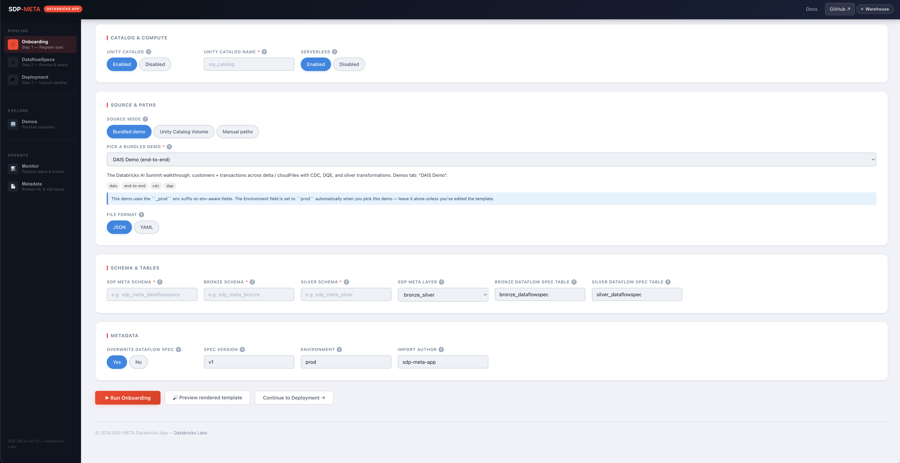
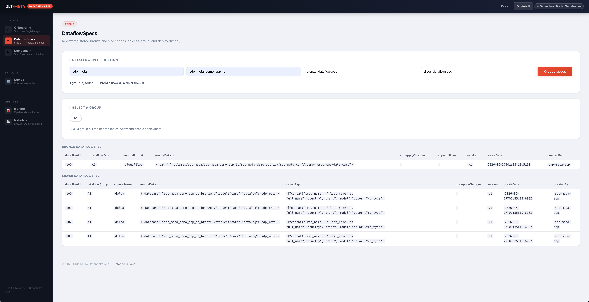
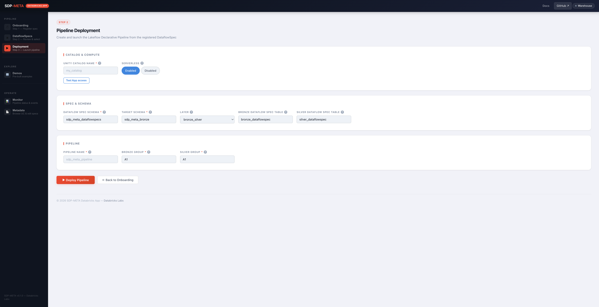
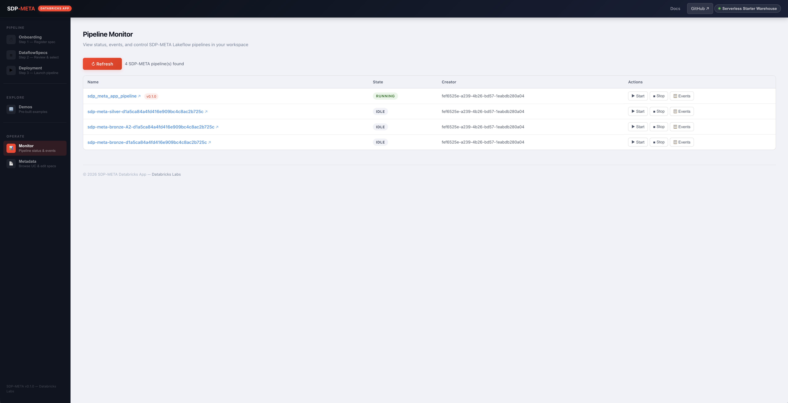
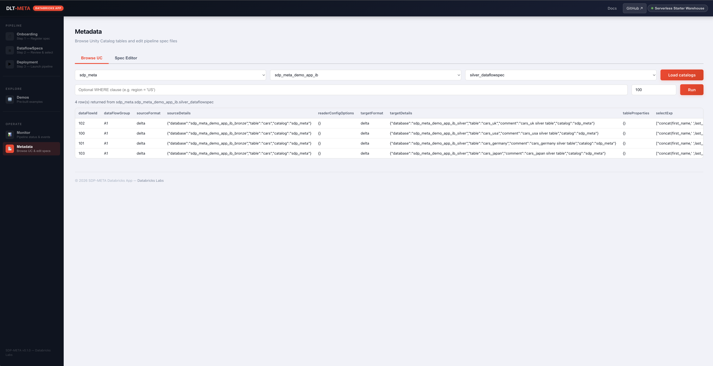
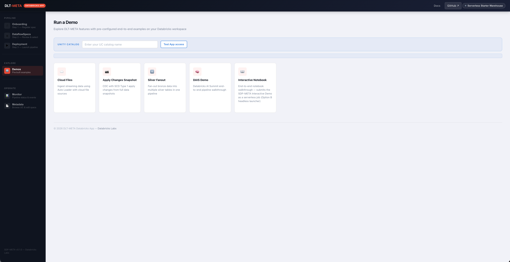
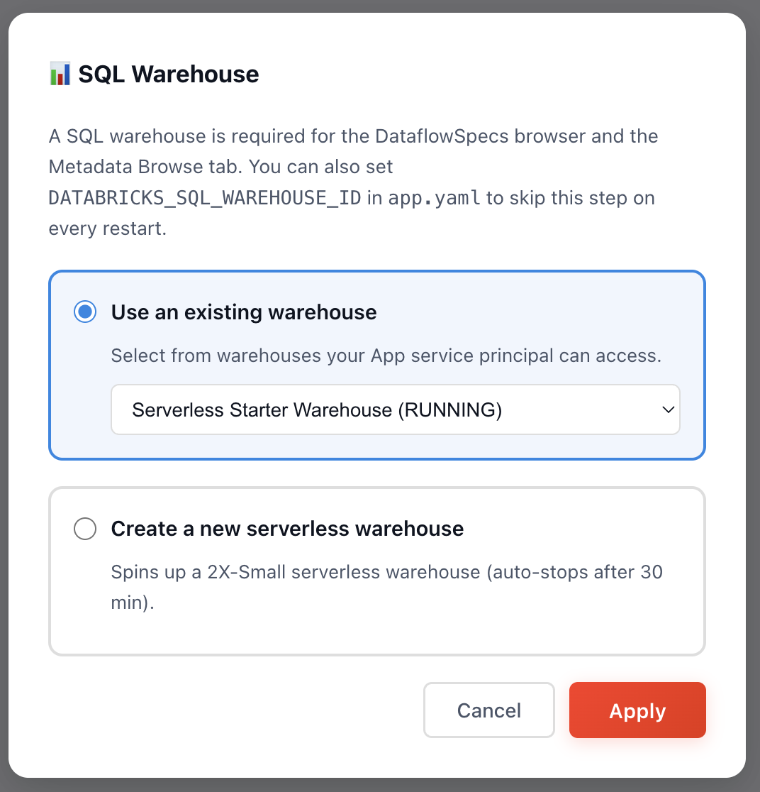

# SDP-META Databricks App

Browser-based GUI for onboarding, deploying, and operating Lakeflow Spark
Declarative Pipelines — no CLI, no hand-edited YAML. **Deploying it? Keep
reading. Using it? Jump to [USER_GUIDE.md](./USER_GUIDE.md).**



> **Requires Unity Catalog.** The App is Unity Catalog–only.

## Documentation

| Doc | Read when |
|---|---|
| **README** *(this file)* | Deploying to Databricks, running locally, authenticating |
| **[USER_GUIDE.md](./USER_GUIDE.md)** | Actually *using* the running app — every panel, form field, validation rule, and HTTP endpoint |
| [GETTING_STARTED.md](./GETTING_STARTED.md) | First-time end-to-end onboarding walkthrough |
| [WINDOWS_DEPLOY.md](./WINDOWS_DEPLOY.md) | Windows-specific deploy details (PowerShell + `.gitattributes` gotcha) |
| [UI_GIT_DEPLOY.md](./UI_GIT_DEPLOY.md) | Deploy from the Databricks UI + a Git folder (no local CLI) |

---

## Prerequisites

### System Requirements
- Python 3.10 or higher
- [Databricks CLI](https://docs.databricks.com/en/dev-tools/cli/tutorial.html) (v0.244.0 or later)
- Configured Databricks workspace access
- **Unity Catalog enabled** on the target workspace, with a catalog the App service principal can `USE CATALOG` and `CREATE SCHEMA` on (use the in-App **Test App access** button to verify before running a demo or onboarding).

### How paths work

The app relies on an environment variable `PYTHONPATH` that must point to the **root of the
sdp-meta repository** — the directory that contains both `src/` and `demo/`.  Every demo script
and the onboarding/deploy CLI live inside that tree, so this must be set correctly before the
app will work.

| Deployment | Where to set `PYTHONPATH` |
|---|---|
| Databricks App | App environment variable in the workspace UI |
| Local dev | Export in your shell before starting the server |

---

## App service principal permissions

Read this **before** you deploy — the App can't do anything useful in
Unity Catalog until its service principal has the right grants, and
those grants can only be issued by a catalog admin (the SP cannot
grant privileges to itself).

The app runs as a dedicated service principal whose name follows the form
`app-XXXXXX_<app-name>` (the `XXXXXX` prefix is platform-assigned; the
suffix matches the App resource name you'll create in *Deploy → step 2*).
Grant it the following in your Unity Catalog:

- `USE CATALOG` on the target catalog
- `CREATE SCHEMA`, `USE SCHEMA` on the target schemas
- `CREATE TABLE` on the bronze and silver schemas

Copy-paste template (fill in the placeholders after step 2 below):

```sql
GRANT USE CATALOG ON CATALOG <target_catalog>
    TO `app-XXXXXX_<app-name>`;
GRANT CREATE SCHEMA, USE SCHEMA ON CATALOG <target_catalog>
    TO `app-XXXXXX_<app-name>`;
GRANT CREATE TABLE ON SCHEMA <target_catalog>.<bronze_schema>
    TO `app-XXXXXX_<app-name>`;
GRANT CREATE TABLE ON SCHEMA <target_catalog>.<silver_schema>
    TO `app-XXXXXX_<app-name>`;
```

**Verification.** The Demos tab ships a **Test App access** button that
calls `/check-uc-grants` and probes whether the App SP currently has
`USE_CATALOG` + `CREATE_SCHEMA` on the catalog you entered. If a grant
is missing, the response includes the exact `GRANT` SQL the catalog
owner should run — so you can copy-paste and retry without guessing.

---

## Deploy to Databricks

Primary path — `scripts/deploy_app.sh` from a macOS / Linux / WSL shell.
Alternatives are documented at the end of this file:

- **Windows (native PowerShell)** → [Appendix A](#appendix-a-windows-deployment-native-powershell)
- **No CLI, Databricks UI + Git folder only** → [Appendix B](#appendix-b-deploy-via-apps-ui--git-folder-no-cli)

---

### 1. Authenticate

```bash
databricks auth login --host WORKSPACE_HOST
```

### 2. Create the app

```bash
databricks apps create demo-sdp-meta
```

> Wait a couple of minutes for the app compute to provision.

### 3. Deploy with the deploy script (recommended)

```bash
# Run from the sdp-meta repo root
cd /path/to/sdp-meta

./scripts/deploy_app.sh \
  --profile <DATABRICKS_CLI_PROFILE> \
  --app     <YOUR_APP_NAME> \
  --path    /Workspace/Users/<you@databricks.com>/<workspace-folder>
```

Run `./scripts/deploy_app.sh -h` for the full argument list. `--app` defaults
to `demo-sdp-meta` (matches step 2). Windows users: see
[Appendix A](#appendix-a-windows-deployment-native-powershell) for the
PowerShell equivalent.

**Why this script and not raw `databricks sync` + `databricks apps deploy`?**
Two things the platform-native commands won't do for you:

1. **Inject `app.yaml` at the deploy root.** The Apps platform requires
   `app.yaml` at the source-code-path root, but we keep the working tree
   identical to upstream so the file isn't committed. The deploy script
   stages the repo into a tempdir, writes `app.yaml` + `requirements.txt`
   at the staging root, and syncs that — not the raw working tree.
2. **Disguise the interactive demo notebook.** `demo/SDP_META_INTERACTIVE_DEMO.py`
   starts with `# Databricks notebook source`, which causes plain
   `databricks sync` to upload it as a Notebook (the `.py` extension is
   stripped). The Apps container then can't find `demo/SDP_META_INTERACTIVE_DEMO.py`
   and the Interactive Demo fails with `Demo notebook source not found`.
   The deploy script renames the staged copy to `.nbsource` so the workspace
   stores it as a regular FILE; `databricks_app/start.sh` restores the `.py`
   inside the container at startup.

If you skip the script and run `databricks sync . <WS_PATH> && databricks apps deploy …`
manually, expect both issues — the app will crash with `error: no commands supplied`
on startup, and the Interactive Demo will be broken even if you patch the
crash.

**What `start.sh` does inside the container:**
1. Detects Mode A vs Mode B layout (`demo/` + `src/` next to `start.sh`?).
2. Installs `wheel` + `setuptools`, runs `python setup.py bdist_wheel`,
   `pip install`s the resulting `databricks_labs_sdp_meta-*.whl`.
3. Restores `demo/SDP_META_INTERACTIVE_DEMO.py` from the staged `.nbsource`
   copy (if absent in the working tree).
4. Verifies `demo/` and `integration_tests/` are present.
5. `exec`s `gunicorn` (1 worker, 120s timeout) bound to
   `$DATABRICKS_APP_PORT` (defaults to 8000 locally). 

**Directory layout inside the container (`/app/python/source_code/`):**
```
setup.py
app.yaml              ← injected by scripts/deploy_app.sh (not in the repo)
requirements.txt      ← injected by scripts/deploy_app.sh (copied from databricks_app/)
src/                  ← sdp-meta source (built into a wheel by start.sh)
demo/                 ← demo scripts (no copy needed — already here)
integration_tests/    ← imported by demo scripts
databricks_app/
    app.py
    start.sh
    templates/
```

> **No extra environment variable needed.** The app derives the repo root from
> `databricks_app/../` automatically. Set `SDP_META_HOME` only if you use a
> non-standard layout.

### 4. Access the app

Open the URL shown in step 2, or navigate:
**Databricks Web UI → Compute → Apps → select `<your-app-name>`**

> **Next: use the app.** Every panel, form field, validation rule, and
> HTTP endpoint is documented in **[USER_GUIDE.md](./USER_GUIDE.md)** —
> start there for the canonical **Onboarding → DataflowSpecs →
> Deployment** walkthrough.

---

## Run locally (macOS / Linux)

### 1. Clone and install

```bash
git clone https://github.com/databrickslabs/sdp-meta.git
cd sdp-meta

python3 -m venv .venv
source .venv/bin/activate          # Windows: .venv\Scripts\activate

# Flask + the small set of runtime deps the App needs
pip install -r databricks_app/requirements.txt

# Install sdp-meta in editable mode so the App and demos can import it
# without rebuilding a wheel on every restart.
pip install -e .
```

### 2. Authenticate to Databricks

`app.py` constructs `WorkspaceClient()` with no arguments and lets the SDK's
default credential chain resolve auth. Pick **one** of the options below; the
demo subprocesses inherit the same env vars automatically.

| Option | Setup | When to use |
|---|---|---|
| **A. `[DEFAULT]` profile** *(recommended)* | `databricks auth login --host <WORKSPACE_HOST>` (OAuth U2M) — caches into `~/.databrickscfg [DEFAULT]`. Nothing else to set. | You only ever target one workspace. |
| **B. Named profile** | `databricks configure --profile <name> --host <WORKSPACE_HOST> --token <PAT>` then `export DATABRICKS_CONFIG_PROFILE=<name>` | You switch between workspaces. |
| **C. PAT env vars** | `export DATABRICKS_HOST=<WORKSPACE_HOST>` and `export DATABRICKS_TOKEN=<PAT>` | Throwaway shells, CI. |

Resolution order is: PAT env vars → `DATABRICKS_CONFIG_PROFILE` → `[DEFAULT]`
in `~/.databrickscfg`. **No `--profile` flag is needed** — if nothing is set
the SDK falls back to `[DEFAULT]` automatically.

Verify before launching the App:

```bash
python -c "from databricks.sdk import WorkspaceClient; \
  w = WorkspaceClient(); \
  print('host=', w.config.host, 'auth=', w.config.auth_type, \
        'as=', w.current_user.me().user_name)"
```

If that prints your workspace host and your username, the App will work.

### 3. Start Flask from the repo root

```bash
# Tell app.py where the repo root is (so demo/, src/, integration_tests/ resolve)
export SDP_META_HOME="$PWD"

# Suppress browser tabs that the CLI would otherwise pop after onboard/deploy
export SDP_META_NO_BROWSER=1

# Optional: hot reload on code edits
export FLASK_DEBUG=true

# Optional: pick a non-default profile (matches the Apps "--profile" semantic)
# export DATABRICKS_CONFIG_PROFILE=<name>

flask --app databricks_app/app.py run --host 127.0.0.1 --port 8000
```

Open **http://127.0.0.1:8000**.

> Port 8000 mirrors the production `start.sh` default (which binds
> `${DATABRICKS_APP_PORT:-8000}`). Use any free port if 8000 is taken.

### 4. Identity caveat (local vs Apps)

| Context | Identity that issues UC / job / pipeline calls |
|---|---|
| Databricks Apps container | App service principal (`app-XXXXXX_<app-name>`) |
| Local Mac/Linux | **You** (the user whose PAT or OAuth tokens are on disk) |

This means:

- The **Test App access** button (`/check-uc-grants`) probes **your** grants
  on the catalog, not an App SP's. Demos run if you have `USE CATALOG` +
  `CREATE SCHEMA` on the target catalog (you usually do).
- To exercise the production "grant required" failure path locally, point
  the App at a catalog where your user lacks `CREATE SCHEMA`.

### 5. Common gotchas

- **`ModuleNotFoundError: databricks.labs.sdp_meta`** — you skipped
  `pip install -e .` in step 1.
- **Browser tab opens after every CLI action** — set
  `export SDP_META_NO_BROWSER=1` (already in step 3 above).
- **Port already in use** — `lsof -i :8000` to find the holder, or pass a
  different `--port`.
- **`Demo notebook source not found at .../SDP_META_INTERACTIVE_DEMO.py`** —
  you deployed the app with raw `databricks sync .` + `databricks apps deploy`
  instead of `./scripts/deploy_app.sh` (or `.\scripts\deploy_app.ps1` on
  Windows). The sync uploaded the file as a Databricks notebook (extension
  stripped) and `start.sh` had no `.nbsource` staged copy to restore from.
  Redeploy with the script.
- **App crashes on first deploy from Windows with `bad interpreter: /bin/bash\r`
  or `\r: command not found`** — CRLF line endings reached the Linux App
  container. Fix steps and the underlying `.gitattributes` policy are in
  [WINDOWS_DEPLOY.md → Troubleshooting](./WINDOWS_DEPLOY.md#troubleshooting).

### 6. Mirror the App container's full boot path (optional)

To exercise the exact code path the production runtime uses (wheel build +
install + Flask launch), run `start.sh` directly:

```bash
bash databricks_app/start.sh
```

Slower (rebuilds the wheel every time), but it's the closest you can get to
production locally short of deploying.

---

## Using the app

This README focuses on **deploy / local dev / auth**. For a complete walkthrough
of every panel and feature in the running app, see **[USER_GUIDE.md](./USER_GUIDE.md)**.

### The canonical pipeline flow

Three panels, left-to-right, each auto-filling the next — you type the
catalog / schema / table names exactly once.

| 1 · Onboarding | 2 · DataflowSpecs | 3 · Deployment |
|---|---|---|
|  |  |  |
| Register a spec → bronze/silver `dataflowspec` rows in UC | Review the rows onboarding wrote, pick a `data_flow_group` | Generate a Lakeflow Spark Declarative Pipeline from the selected group |

### Operate & explore

| Monitor | Metadata browser | Demos |
|---|---|---|
|  |  |  |
| Filtered list of SDP-META pipelines with start/stop, in-app events, and click-through to the Databricks pipeline UI | Browse UC catalogs / schemas / tables + in-app spec editor with 3-layer validation | Pre-built end-to-end examples (Cloud Files, ACFS, Silver Fanout, DAIS, Interactive) |

### Top bar

The warehouse chip configures the SQL warehouse used by DataflowSpecs and
the Metadata browser. Green = running, amber = stopped, grey = unset.



Full per-panel reference (fields, endpoints, validation rules) lives in
[USER_GUIDE.md](./USER_GUIDE.md).

> **Reminder.** Nothing in the app works until the App SP has the Unity
> Catalog grants listed in [App service principal permissions](#app-service-principal-permissions)
> near the top of this doc. Use the Demos → **Test App access** button
> to verify.

---

## Appendix A: Windows deployment (native PowerShell)

The bash script (`scripts/deploy_app.sh`) doesn't run on Windows
`cmd.exe` or PowerShell — it uses POSIX constructs and `rsync`.
`scripts/deploy_app.ps1` is a native PowerShell port that performs the
same staging + sync + deploy flow using only Windows-built-in tooling
(`robocopy`) and the `databricks` CLI.

```powershell
# Run from the sdp-meta repo root
cd C:\path\to\sdp-meta

.\scripts\deploy_app.ps1 -DatabricksProfile <DATABRICKS_CLI_PROFILE> `
                         -App <YOUR_APP_NAME> `
                         -Path /Workspace/Users/email/<workspace-folder>
```

**Windows-specific behavior the script handles for you** (in addition to
the two things `deploy_app.sh` handles per *Deploy → step 3* above):

- **Line-ending normalization.** Windows git's default `core.autocrlf=true`
  checks out `start.sh` with CRLF, and the Linux App container would crash
  on `bad interpreter: /bin/bash\r`. The script strips `\r` from every
  staged text file before sync. The repo also ships a `.gitattributes`
  policy that pins LF for shell scripts so this stops being an issue
  after a one-time `git add --renormalize .`.

See **[WINDOWS_DEPLOY.md](./WINDOWS_DEPLOY.md)** for the full argument
reference, env-var fallbacks, execution-policy notes, and Windows-specific
troubleshooting.

---

## Appendix B: Deploy via Apps UI + Git folder (no CLI)

Click-only alternative — no Databricks CLI, no local Python, no
`rsync` / `robocopy`. Point a Databricks Git folder at this repo,
create an App in the UI, and aim it at `databricks_app/`.
`start.sh`'s **Mode B** clones the full `sdp-meta` repo into
`/tmp/sdp-meta` at container start, so `setup.py`, `src/`, `demo/`,
and `integration_tests/` are all available without any local sync.

**When to use:** You have Databricks workspace access but no local CLI
setup, and you're deploying a **published branch** on
github.com/databrickslabs/sdp-meta (not local unmerged changes).

**When *not* to use:**
- Air-gapped App compute that can't reach github.com — Mode B's
  `git clone` fails at boot.
- You want to deploy local unmerged edits — Git folders only see
  pushed commits.
- You need a fork or private mirror — Mode B's `REPO_URL` is hard-coded
  to `databricks/sdp-meta`.

See **[UI_GIT_DEPLOY.md](./UI_GIT_DEPLOY.md)** for the full
step-by-step (Git-folder setup, App creation, source-code-path
configuration, UC grants, re-deploy flow).
