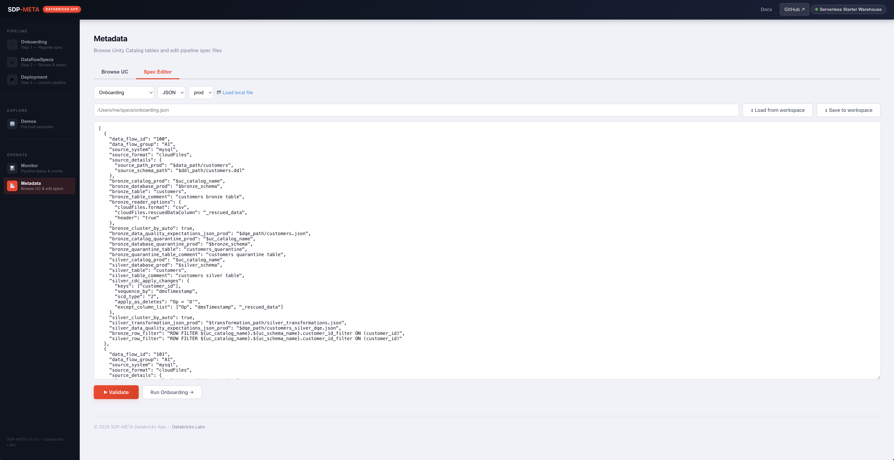

# SDP-META Databricks App — User Guide

Quick reference for every panel in the app. For deploy / local-dev / auth see
[README.md](./README.md).

## Contents

1. [The flow](#1-the-flow)
2. [First-time setup](#2-first-time-setup)
3. [Top bar](#3-top-bar)
4. [Step 1 — Onboarding](#4-step-1--onboarding)
5. [Step 2 — DataflowSpecs](#5-step-2--dataflowspecs)
6. [Step 3 — Deployment](#6-step-3--deployment)
7. [Monitor](#7-monitor)
8. [Metadata](#8-metadata)
9. [Demos](#9-demos)
10. [App SP permissions](#10-app-sp-permissions)
11. [HTTP API](#11-http-api)
12. [Troubleshooting](#12-troubleshooting)

---

## 1. The flow

```
Pipeline    Onboarding  →  DataflowSpecs  →  Deployment
            Step 1          Step 2             Step 3

Explore     Demos

Operate     Monitor         Metadata
```

Happy path is left-to-right. Each step **auto-fills the next**, so catalog /
schema / table names are typed exactly once. Manual edits are never
overwritten — only empty fields are filled.

---

## 2. First-time setup

| # | Action | Where |
|---|---|---|
| 1 | Configure a SQL warehouse (use existing, or create a 2X-Small serverless one) | Top-bar **Warehouse** chip |
| 2 | Verify the App SP has `USE_CATALOG` + `CREATE_SCHEMA` on your catalog | Demos → **Test App access** |
| 3 | Pick your onboarding mode | Onboarding → mode radio |

To persist the warehouse across redeploys, copy its ID from the success
message into `databricks_app/app.yaml`:

```yaml
env:
  - name: DATABRICKS_SQL_WAREHOUSE_ID
    value: "<warehouse-id>"
```

---

## 3. Top bar

| Element | Action |
|---|---|
| **Docs** | Opens docs site (new tab) |
| **GitHub** | Opens repo (new tab) |
| **Warehouse** chip | Configure / inspect SQL warehouse. Green = running, amber = stopped, grey = unset |

Clicking the **Warehouse** chip opens the picker, which lists every warehouse the App SP can see and lets you set the active one for the session (or persist it via `DATABRICKS_SQL_WAREHOUSE_ID` in `app.yaml`):


---

## 4. Step 1 — Onboarding

**Output:** bronze + silver `*_dataflowspec` rows in UC + a UC volume holding
copied JSON/DDL supporting files.


### Mode picker

| Mode | Path source |
|---|---|
| **Bundled demo** | Dropdown of curated specs under `demo/` |
| **UC Volume** | `/Volumes/<cat>/<sch>/<vol>/<file>` |
| **Manual** | Free-form path (repo-relative, workspace, or absolute) |

#### Bundled demo dropdown

Curated to **only contain specs that onboard out-of-the-box** with the default
form values. Every entry below works on the first click; the picker hides any
spec that would need external infrastructure (Event Hubs, Kafka, custom UC
source tables) or multi-step orchestration.

| Demo | What it shows | Notes |
|---|---|---|
| **Cars (Simple bronze + silver)** *(default)* | Single Auto Loader CSV → bronze `cars` + silver `cars_usa` | Simplest demo; recommended first run |
| **Multi-Source CDC** | Three regional Auto Loader sources (US / EU / APAC) → three bronze CDC tables | Best for showing the metadata-driven pattern |
| **Silver Fanout (one bronze → many silver)** | One Auto Loader CSV → bronze `cars` → four region-specific silver tables (`cars_usa` / `cars_germany` / `cars_uk` / `cars_japan`) sharing the same bronze | Single onboarding pass; fanout consumer rows omit `source_details` and the bronze pass skips them so the silver pass picks them up |
| **Cloud Files (Auto Loader)** | Streaming JSON → bronze + silver with row-filter UDF and DQE | Picker transparently merges the A2 companion's `customers_delta` producer into the same onboarding pass |
| **DAIS Demo (end-to-end)** | DAIS walkthrough: customers + transactions, CDC + DQE + silver transformations | Auto-sets the **Environment** field to `prod` when selected (the template uses `_prod` suffixes) |

### Required fields

| Field | Notes |
|---|---|
| Unity Catalog enabled | Toggle UC vs HMS |
| Unity Catalog name | Identifier-validated |
| Onboarding file path | Populated by mode picker |
| SDP-META schema | Holds DataflowSpec tables (created if missing) |
| Bronze / Silver schema | Created if missing |
| Bronze / Silver table | Default `bronze_dataflowspec` / `silver_dataflowspec` |
| Layer | `1` = bronze only, `2` = bronze + silver |
| Environment | **Must match** the `<field>_<env>` suffix in the template, or every row is silently skipped |
| Local directory | Where supporting JSON / DDL live, default `<repo>/demo/` |
| Overwrite | Replaces existing DataflowSpec rows |
| Serverless | Submit job to serverless cluster |

### Preview button (recommended)

Dry-run. No side effects. Surfaces:

- Rendered template (post `{uc_volume_path}` / `{uc_catalog_name}` / `{bronze_schema}` / `{silver_schema}` substitution)
- **Env-suffix mismatch warnings** (catches the #1 silent-failure mode)
- Per-file existence check for every DQE/DDL/transformation path

### Submit

`POST /onboarding` → mints a job token → spawns `sdp-meta onboard_ui` →
frontend streams logs. On success, a **View DataflowSpecs →** CTA navigates
to Step 2 with values pre-filled and the query already run.

---

## 5. Step 2 — DataflowSpecs

**Output:** lets you read back the rows onboarding wrote and pick a
`data_flow_group` to deploy.


| Element | Behavior |
|---|---|
| 4 input fields (catalog / schema / bronze table / silver table) | Auto-filled when arriving from Onboarding |
| **Load DataflowSpecs** | `GET /api/dataflowspecs` — runs `SELECT *` in parallel against both tables |
| **Group pills** | Click to filter both tables to one `data_flow_group` |
| Bronze / Silver grid | Full DataflowSpec rows (scroll horizontally) |
| **Deploy this group →** CTA | Appears once a group is selected. Navigates to Deployment with everything pre-filled including the group(s) |

Common errors: `TABLE_OR_VIEW_NOT_FOUND` (run onboarding first), no warehouse
configured (top-bar chip).

---

## 6. Step 3 — Deployment

**Output:** a Lakeflow Spark Declarative Pipeline tagged `sdp_meta=<version>`.


### Fields

| Field | Notes |
|---|---|
| Pipeline name | Required |
| Unity Catalog name | Required (UC mode) |
| DataFlow Spec schema | Schema containing bronze/silver `*_dataflowspec` |
| Bronze / Silver DataflowSpec table | Defaults match Step 1 |
| Layer | `bronze_silver` *(default — ingest + transform in one pipeline)* / `bronze` / `silver`. Drives which group(s) are required |
| Bronze group | Required when layer ∈ {bronze, bronze_silver} |
| Silver group | Required when layer ∈ {silver, bronze_silver} |
| Target schema | Auto-syncs from layer when blank |
| Serverless | Submit as serverless pipeline |

### Submit

Same machinery as Onboarding: token + log streaming. On success, the modal
includes the workspace URL of the new pipeline.

---

## 7. Monitor

**Output:** all SDP-META pipelines in the workspace, with start/stop +
events + click-through to the Databricks UI.


### Filter

A pipeline is shown if either:

1. Tag `sdp_meta=<any-non-empty-value>` (includes legacy `sdp_meta=true`)
2. `configuration` contains any of `bronze.dataflowspecTable`,
   `silver.dataflowspecTable`, `bronze.group`, `silver.group`

### Columns

| Column | Content |
|---|---|
| Name | External link (↗) to `<host>/pipelines/<id>` + version chip (e.g. `v0.1.0`) |
| State | `IDLE` / `RUNNING` / `FAILED` / `STOPPED` badge |
| Creator | Owning principal |
| Actions | **Start** / **Stop** / **Events** (in-app drawer with last 50 events) |

Falls back to the in-app events drawer on the name click if the workspace
host can't be resolved.

---

## 8. Metadata

Two tools share this panel.

### UC browse

Cascading dropdowns: **Catalog → Schema → Table**. Picking a table runs
`SELECT * ... LIMIT N` (max 1000) with an optional `WHERE` clause via the
Statement Execution API.


### Spec editor

| Action | Endpoint | Notes |
|---|---|---|
| List workspace path | `GET /api/metadata/workspace-ls` | |
| Load file | `GET /api/metadata/workspace-file` | JSON / YAML auto-detected |
| Save file | `POST /api/metadata/workspace-file` | Parse-validates before writing |
| **Validate** | `POST /api/metadata/parse-spec` | 3-layer (see below) |



### Three-layer validation

| Layer | Catches | Runs when |
|---|---|---|
| 1 — Syntax | JSON / YAML parse | Always |
| 2 — Semantics | UC identifiers, source format, CDC `scd_type`, DQE actions, silver transformation shape | sdp-meta wheel installed (always in App container) |
| 3 — File refs | DQE / DDL / transformation paths | Surfaced as warnings only — Spark required to verify |

Supported `spec_type`: `onboarding`, `dqe`, `silver_transform`.

---

## 9. Demos

Click **Test App access** first — every demo subprocess re-runs the preflight
and a missing grant returns the GRANT SQL you need.


| Demo | What it runs |
|---|---|
| Cloud Files | Auto Loader + a `row_filter` UDF |
| Apply Changes Snapshot | CDC SCD Type 1 from snapshots |
| Silver Fanout | One bronze → many silver |
| DAIS Demo | DAIS end-to-end walkthrough |
| Interactive Demo | Submits `SDP_META_INTERACTIVE_DEMO` notebook as a 1-step job; `pip install`s `databricks-labs-sdp-meta` from PyPI on every launch |

**Removed:** DLT Sink (Kafka/Event-Hubs wiring not available to the App SP)
and DABs (Terraform not in the container). Both still work from a local CLI.

---

## 10. App SP permissions

The SP is named `app-XXXXXX_<app-name>`. Required Unity Catalog grants:

| Privilege | On |
|---|---|
| `USE CATALOG` | target catalog |
| `CREATE SCHEMA` | target catalog |
| `USE SCHEMA` | each target schema |
| `CREATE TABLE` | bronze + silver schemas |

`GET /check-uc-grants?uc_name=<cat>` (Demos → **Test App access**) probes
these and returns the exact GRANT SQL when anything is missing — the SP
can't grant privileges to itself.

---

## 11. HTTP API

| Method + Path | Purpose |
|---|---|
| `POST /onboarding` | Submit onboarding run → job token |
| `POST /onboarding/preview` | Dry-run (no UC side effects) |
| `GET  /onboarding/bundled-specs` | List bundled demo specs |
| `POST /deploy` | Submit pipeline deploy → job token |
| `GET  /api/dataflowspecs` | Query bronze + silver spec tables |
| `GET  /api/pipelines` | List SDP-META pipelines (incl. `sdp_meta_version`, `pipeline_url`) |
| `GET  /api/pipelines/<id>/events` | Last 50 events |
| `POST /api/pipelines/<id>/start` | Trigger update |
| `POST /api/pipelines/<id>/stop` | Stop |
| `GET  /api/metadata/catalogs` | List UC catalogs |
| `GET  /api/metadata/schemas` | List schemas |
| `GET  /api/metadata/tables` | List tables + columns |
| `POST /api/metadata/table-data` | `SELECT * ... LIMIT N` |
| `GET  /api/metadata/workspace-ls` | List workspace path |
| `GET  /api/metadata/workspace-file` | Download workspace file |
| `POST /api/metadata/workspace-file` | Save workspace file (parse-validated) |
| `POST /api/metadata/parse-spec` | 3-layer validation |
| `GET  /api/warehouse/status` | Active warehouse + state |
| `GET  /api/warehouse/list` | All visible warehouses |
| `POST /api/warehouse/configure` | Set runtime warehouse |
| `GET  /check-uc-grants` | Probe App SP UC grants |
| `POST /rundemo` | Launch a named demo |
| `GET  /api/job/<token>/logs` | Poll buffered stdout/stderr |

Error shapes: **400** for client-correctable input (`{error}`, sometimes
`{grant_required:true, grant_sql:"..."}`); **500** for SDK / server
exceptions (`{error, stdout, stderr, returncode, modal_content}`).

---

## 12. Troubleshooting

| Symptom | Cause | Fix |
|---|---|---|
| Onboarding succeeds but DataflowSpec tables are empty | `environment` field doesn't match the template's `<field>_<env>` suffix | Click **Preview** — `env_warning` names the right suffix |
| `TABLE_OR_VIEW_NOT_FOUND` on DataflowSpecs load | Onboarding not yet run for this catalog/schema | Run onboarding |
| "No SQL warehouse configured" | Step 1 of first-time setup not done | Top-bar Warehouse chip |
| Monitor shows zero pipelines after deploy | Pipeline created outside the App lacks the `sdp_meta` tag | Use `sdp-meta deploy_ui` — it tags automatically |
| Monitor name click opens events drawer instead of new tab | Backend couldn't resolve `ws.config.host` | Local only — set `DATABRICKS_HOST` or `~/.databrickscfg.host` |
| "Demo notebook source not found" (Interactive Demo) | App deployed with raw `databricks sync` instead of `scripts/deploy_app.sh` | Redeploy with the script |
| Demo modal shows "Grant required" panel | App SP missing UC grants | Copy/paste GRANT SQL, run as catalog owner, retry |
| "Required fields missing" 400 | Form bypassed client-side check | Fill the named fields |
| "Could not render template after substitution" on Preview | Substitution value broke YAML indentation / had unescaped quotes | Sanitize the catalog / schema / volume name |
| Job log stream stops | Subprocess died | `GET /api/job/<token>/logs` returns `{done:true}` on exit; check App stdout for traceback |

---

## See also

- [README.md](./README.md) — deploy, local dev, auth
- [Repo README](../README.md) — project overview, CLI, bundles
- [SDP-META docs](https://databrickslabs.github.io/dlt-meta/index.html)
