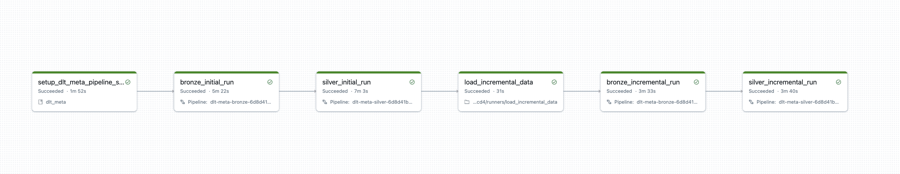
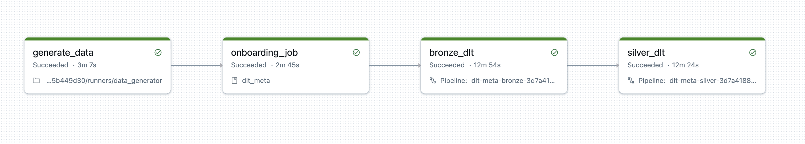
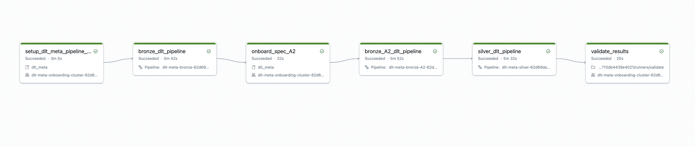
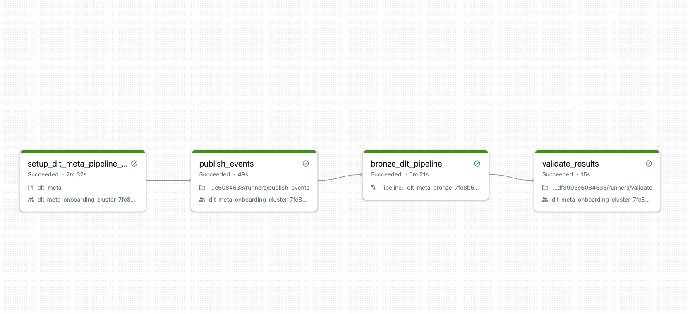
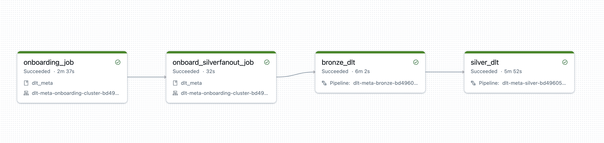
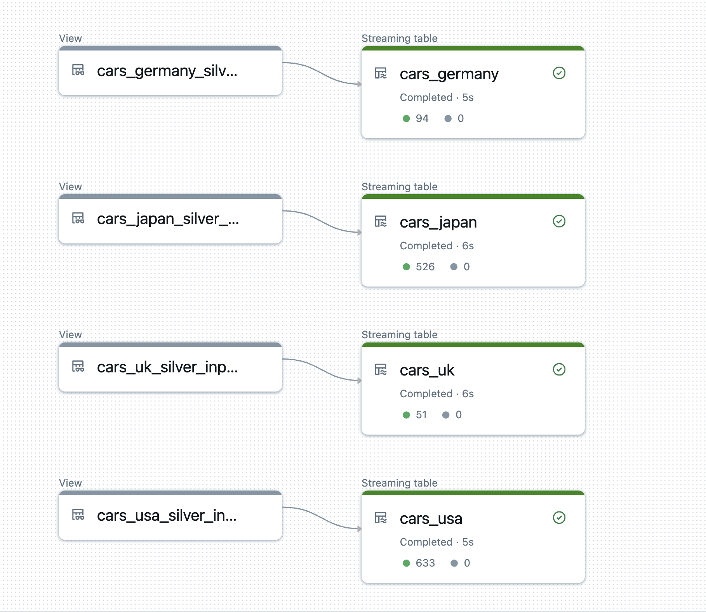
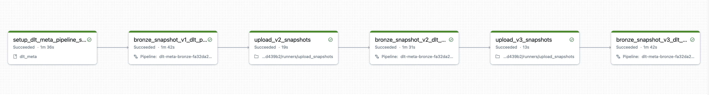
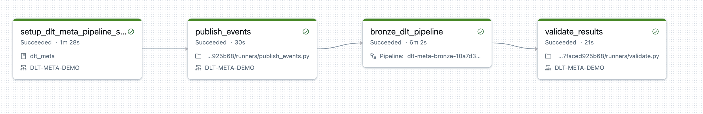
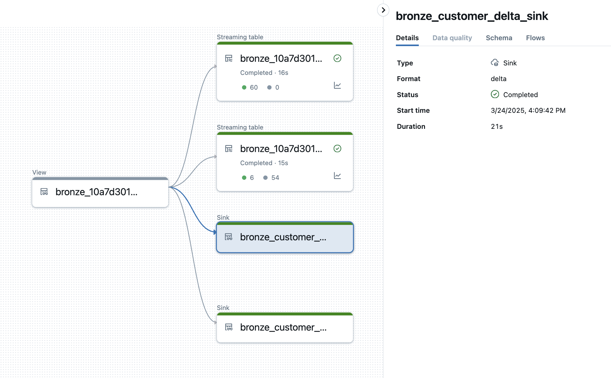
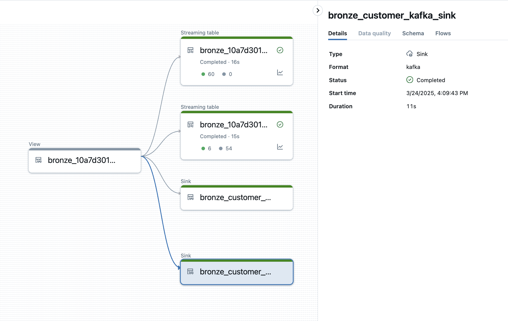

 # [SDP-META](https://github.com/databrickslabs/dlt-meta) DEMOs
 1. [Interactive Demo (Notebook)](#interactive-demo-notebook): **Start here.** A fully self-contained Databricks notebook covering all SDP-META features end-to-end — no CLI required.
 2. [DAIS 2023 DEMO](#dais-2023-demo): Showcases SDP-META's capabilities of creating Bronze and Silver pipelines with initial and incremental mode automatically.
 3. [Databricks Techsummit Demo](#databricks-tech-summit-fy2024-demo): 100s of data sources ingestion in bronze and silver pipelines automatically.
 4. [Append FLOW Autoloader Demo](#append-flow-autoloader-file-metadata-demo): Write to same target from multiple sources using [dp.append_flow](https://docs.databricks.com/aws/en/ldp/developer/ldp-python-ref-append-flow) and adding [File metadata column](https://docs.databricks.com/aws/en/ingestion/file-metadata-column)
 5. [Append FLOW Eventhub Demo](#append-flow-eventhub-demo): Write to same target from multiple sources using [dp.append_flow](https://docs.databricks.com/aws/en/ldp/developer/ldp-python-ref-append-flow) and adding [File metadata column](https://docs.databricks.com/aws/en/ingestion/file-metadata-column)
 6. [Silver Fanout Demo](#silver-fanout-demo): This demo showcases the implementation of fanout architecture in the silver layer.
 7. [Apply Changes From Snapshot Demo](#apply-changes-from-snapshot-demo): This demo showcases the implementation of ingesting from snapshots in bronze layer
 8. [Lakeflow Spark Declarative Pipelines Sink Demo](#lakeflow-declarative-pipelines-sink-demo): This demo showcases the implementation of write to external sinks like delta and kafka
 9. [DAB Demo](#dab-demo): End-to-end walkthrough of the `databricks labs sdp-meta bundle-*` CLI — scaffold a Declarative Automation Bundle, append flows, validate, deploy, and run onboarding + Lakeflow Spark Declarative Pipelines from one driver script. See [`DAB_README.md`](../DAB_README.md) for the full CLI / template / recipe reference.


# Interactive Demo (Notebook)

**Recommended starting point** — a single Databricks notebook that walks through all SDP-META features
end-to-end with no CLI setup required.

- **Notebook:** [`demo/SDP_META_INTERACTIVE_DEMO.py`](SDP_META_INTERACTIVE_DEMO.py) — run interactively in the Databricks workspace.
- **Headless launcher:** [`demo/launch_interactive_demo.py`](launch_interactive_demo.py) — submit the same notebook as a one-time serverless job from your laptop / CI.

## What It Covers

| Stage | Feature |
|-------|---------|
| 1 | Setup — UC catalog, schemas, volume, config files, synthetic data |
| 2 | Onboarding — JSON → DataflowSpec tables (`bronze_dataflowspec`, `silver_dataflowspec`) |
| 3 | Pipeline creation and first run (fully automated via Databricks SDK) |
| 4 | Validate initial Bronze + Silver tables, quarantine tables, SCD Type 2 history |
| 5 | Add new feeds (Products & Stores) without modifying the pipeline |
| 6 | Incremental CDC load (Insert / Update / Delete) |
| 7 | Validate incremental results — `__START_AT` / `__END_AT` history |
| 8 | Append Flow — multi-source ingestion with file metadata columns |
| 9 | Apply Changes From Snapshot — SCD Type 1 & 2 from CSV/Delta snapshots |
| 10 | DLT Sink — write Bronze output to an external Delta table |

## Features Demonstrated

- Metadata-driven onboarding (JSON or YAML → DataflowSpec → generic pipeline)
- CloudFiles (Autoloader) ingestion with schema enforcement
- Data quality rules: `expect_or_drop` and `expect_or_quarantine`
- Quarantine tables for bad records
- CDC with `apply_changes` (SCD Type 2)
- Liquid clustering (`cluster_by_auto`)
- Silver transformations via JSON (column selection, expressions)
- Adding new feeds without pipeline code changes
- `dp.append_flow` — multiple sources → same target table
- `_metadata.file_name` / `_metadata.file_path` file metadata columns
- `apply_changes_from_snapshot` — snapshot-based SCD Type 1 & 2
- `dp.create_sink` — write to external Delta destinations
- All Lakeflow Spark Declarative Pipelines created with `serverless=True`

## Prerequisites

- Databricks workspace with Unity Catalog enabled
- A UC catalog you have `CREATE SCHEMA` + `CREATE VOLUME` privileges on

## Widgets

The notebook is fully driven by widgets at the top — same ones the headless launcher pre-populates via `base_parameters`.

| Widget | Choices / default | Purpose |
|---|---|---|
| `git_branch` | text, default `main` | Branch to install SDP-META from when `install_source=git_branch`. Also used as the GitHub branch for the conf-file fallback if the notebook is imported standalone. |
| `uc_catalog_name` | text, default `sdp_meta_demo` | UC catalog the demo writes into. Must be a Databricks SQL **regular identifier** (`[A-Za-z_][A-Za-z0-9_]*`, max 255 chars). Hyphens / dots are rejected up-front (issue #261). |
| `uc_schema_name` | text, default `retail_data` | Schema within the catalog. Same identifier rules as above. The demo creates `<schema>_bronze`, `<schema>_silver`, `<schema>_pipeline_default` underneath. |
| `data_source` | dropdown `dbdatagen` (default) / `github` | `dbdatagen` generates synthetic retail data with `dbldatagen` (no internet needed); `github` downloads fixed CSVs from the dlt-meta repo (requires outbound internet from the workspace). |
| `onboarding_format` | dropdown `json` (default) / `yml` | Whether the rendered onboarding spec + silver-transformations files are written as JSON or YAML. The demo reads back the matching `demo/conf/<format>/sample_onboarding.<ext>` template. |
| `install_source` | dropdown `git_branch` (default) / `whl_file` | Where to install SDP-META from. `git_branch` runs `pip install git+https://github.com/databrickslabs/dlt-meta.git@<git_branch>`; `whl_file` runs `pip install <whl_file_path>` against a Volume / Workspace path. Use `whl_file` when validating local changes that aren't pushed yet. |
| `whl_file_path` | text, default empty | Path to the wheel when `install_source=whl_file`, e.g. `/Volumes/<catalog>/<schema>/<volume>/databricks_labs_sdp_meta-<version>-py3-none-any.whl`. Required when `install_source=whl_file`; ignored otherwise. |
| `validate_counts` | dropdown `false` (default) / `true` | When `true`, the final cell turns the demo into a smoke test: it asserts deterministic row counts (`bronze.orders == 7`, `bronze.iot_events == 5`, snapshot tables `>= LOAD_2 size`) and non-empty for every demo-produced bronze / silver / quarantine table, raising a single `AssertionError` listing every failure. Use in CI / pre-release smoke runs. |
| `cleanup` | dropdown `false` (default) / `true` | When `true`, the cleanup cell at the bottom drops every per-run resource the demo created: pipelines (main / snapshot / sink), runner notebooks (`runner_notebook_path`, `snapshot_runner_path`), and per-run schemas (`<schema>_bronze`, `<schema>_silver`, `<schema>_pipeline_default`, `<schema>` itself — including its config volume). The user-supplied UC catalog is **intentionally preserved** because it's shared across runs. |

## Option A — Run interactively in the workspace

1. Import the notebook into your Databricks workspace:
   - In the sidebar click **Workspace** → **Import**
   - Upload `demo/SDP_META_INTERACTIVE_DEMO.py`, or paste the GitHub raw URL.
   - To use the workspace-co-located conf path (offline-friendly, no GitHub roundtrip), import the notebook into a folder that contains a `demo/` segment so its workspace path looks like `.../demo/SDP_META_INTERACTIVE_DEMO`. Otherwise the demo falls back to fetching `demo/conf/<fmt>/sample_onboarding.<ext>` from `raw.githubusercontent.com/databrickslabs/dlt-meta/<git_branch>/...` — make sure that branch is published.

2. Open the notebook, fill in the widgets above, and click **Run All**. The notebook:
   - Installs SDP-META + optional `dbldatagen` via `%pip install` and restarts Python.
   - Creates all UC resources (catalog membership, per-run schemas, config volume), config files, and demo data automatically.
   - Creates and starts every Lakeflow Spark Declarative Pipeline via the Databricks SDK with `serverless=True`.
   - Blocks and polls until each pipeline run completes before moving to the next stage.
   - Prints live pipeline state updates and the pipeline URL for each run.

> No manual pipeline UI interactions are required — the notebook is fully automated end-to-end.

## Option B — Run headless via the launcher (CI-friendly)

`demo/launch_interactive_demo.py` uploads the demo notebook (and the sibling `demo/conf/<fmt>/sample_onboarding.<ext>` files, so the workspace-co-located lookup always works), submits a one-time serverless job that runs it, prints + opens the run-page URL in your browser immediately so you can watch it live, and waits for completion. On failure it still surfaces the run URL in the summary — no traceback hunting required.

```commandline
# CI smoke run — assert row counts and tear down every per-run resource
python demo/launch_interactive_demo.py \
    --profile <your_profile> \
    --uc-catalog-name <your_catalog> \
    --install-source whl_file \
    --whl-file-path /Volumes/<catalog>/<schema>/<volume>/databricks_labs_sdp_meta-<version>-py3-none-any.whl \
    --data-source dbdatagen \
    --validate-counts true \
    --cleanup true \
    --timeout-minutes 25
```

Local-dev shortcut: build the wheel from the working tree and push it to a UC volume in one shot, instead of having to `pip wheel` and `databricks fs cp` manually:

```commandline
python demo/launch_interactive_demo.py \
    --profile <your_profile> \
    --uc-catalog-name <your_catalog> \
    --build-and-upload-whl \
    --uc-schema-name <wheel_volume_schema> \
    --uc-volume-name sdp_meta_wheels \
    --data-source dbdatagen
```

Run `python demo/launch_interactive_demo.py --help` for the full flag surface. Selected flags map 1:1 onto the widgets:

| CLI flag | Widget it sets | Notes |
|---|---|---|
| `--uc-catalog-name` (required) | `uc_catalog_name` | Validated locally against the SQL identifier rules before any workspace call. |
| `--profile` | n/a (auth) | Databricks CLI profile to authenticate the SDK with. Omit to use ambient creds. |
| `--git-branch` | `git_branch` | Defaults to `main`. |
| `--install-source` | `install_source` | `git_branch` (default) or `whl_file`. |
| `--whl-file-path` | `whl_file_path` | Required when `--install-source whl_file` and `--build-and-upload-whl` is not set. |
| `--build-and-upload-whl` | sets `install_source=whl_file` + `whl_file_path=<uploaded path>` | Builds the local sdp-meta wheel via `bundle_prepare_wheel` and uploads it to `/Volumes/<catalog>/<uc-schema-name>/<uc-volume-name>/`. Requires `--uc-schema-name` and `--uc-volume-name`. |
| `--data-source` | `data_source` | `dbdatagen` (default) or `github`. |
| `--onboarding-format` | `onboarding_format` | `json` (default) or `yml`. |
| `--validate-counts` | `validate_counts` | `true` (default for the launcher) or `false`. When `true`, the job FAILS on row-count regression. |
| `--cleanup` | `cleanup` | `false` (default) or `true`. Set `true` for CI runs that need to leave the workspace clean. |
| `--timeout-minutes` | n/a (driver) | Max wall-clock for the launcher to wait on the job. Default 90; for cold workspaces with all 4 pipelines, 20-25 is comfortable. |

Each launch gets a unique, scannable name in the workspace **Job Runs** UI of the form `sdp-meta-demo-<UTC-timestamp>-<catalog>-<run-id>`, e.g. `sdp-meta-demo-20260427T201235Z-ravi_dlt_meta_uc-57f84fe925a1`. The same `<run-id>` flows through the per-run workspace path (`/Users/<me>/sdp_meta_demo_runs/<run-id>/demo/...`) and the per-run schema (`sdp_meta_demo_<run-id>`) so concurrent runs never collide on bronze / silver tables.

## Cleanup

- **Notebook (interactive):** flip the `cleanup` widget to `true` and re-run the last cell, or call `_cleanup_demo_resources()` from a fresh cell. Both drop only per-run resources; the UC catalog is preserved.
- **Launcher (headless):** pass `--cleanup true`. The cleanup runs as the very last cell of the demo, so it only fires on a successful end-to-end run; failed runs deliberately leave artifacts in place for debugging.
- **Manual:** `DROP CATALOG <name> CASCADE` if you want to nuke the catalog itself (intentionally not done by the demo).

---

# DAIS 2023 DEMO
## [DAIS 2023 Session Recording](https://www.youtube.com/watch?v=WYv5haxLlfA)
This Demo launches Bronze and Silver pipelines with following activities:
- Customer and Transactions feeds for initial load
- Adds new feeds Product and Stores to existing Bronze and Silver Lakeflow Declarative pipeline with metadata changes.
- Runs Bronze and Silver pipeline for incremental load for CDC events

### Steps:
1. Launch Command Prompt

2. Install [Databricks CLI](https://docs.databricks.com/dev-tools/cli/index.html)

3. Install Python package requirements:
   ```commandline
   pip install "PyYAML>=6.0" setuptools databricks-sdk
   pip install delta-spark==3.0.0 pyspark==3.5.5
   ```

4. Clone sdp-meta:
    ```commandline
    git clone https://github.com/databrickslabs/sdp-meta.git
    ```

5. ```commandline
    cd sdp-meta
    ```

6. Set python environment variable into terminal
    ```commandline
    sdp_meta_home=$(pwd)
    ```

    ```commandline
    export PYTHONPATH=$sdp_meta_home
    ```

7. ```commandline
    python demo/launch_dais_demo.py --uc_catalog_name=<<uc catalog name>> --profile=<<DEFAULT>>
    ```
    - uc_catalog_name : Unity catalog name
    - you can provide `--profile=databricks_profile name` in case you already have databricks cli otherwise command prompt will ask host and token.

    

# Databricks Tech Summit FY2024 DEMO:
This demo will launch auto generated tables(100s) inside single bronze and silver pipeline using sdp-meta.

1. Launch Command Prompt

2. Install [Databricks CLI](https://docs.databricks.com/dev-tools/cli/index.html)

3. Install Python package requirements:
   ```commandline
   pip install "PyYAML>=6.0" setuptools databricks-sdk
   pip install delta-spark==3.0.0 pyspark==3.5.5
   ```

4. ```commandline
    git clone https://github.com/databrickslabs/sdp-meta.git
    ```

5. ```commandline
    cd sdp-meta
    ```

6. Set python environment variable into terminal
    ```commandline
    sdp_meta_home=$(pwd)
    ```

    ```commandline
    export PYTHONPATH=$sdp_meta_home
    ```

7. ```commandline
    python demo/launch_techsummit_demo.py --uc_catalog_name=<<uc catalog name>> --profile=<<DEFAULT>>
    ```
    - uc_catalog_name : Unity catalog name
    - you can provide `--profile=databricks_profile name` in case you already have databricks cli otherwise command prompt will ask host and token

    


# Append Flow Autoloader file metadata demo:
This demo will perform following tasks:
- Read from different source paths using autoloader and write to same target using append_flow API
- Read from different delta tables and write to same silver table using append_flow API
- Add file_name and file_path to target bronze table for autoloader source using [File metadata column](https://docs.databricks.com/en/ingestion/file-metadata-column.html)

1. Launch Command Prompt

2. Install [Databricks CLI](https://docs.databricks.com/dev-tools/cli/index.html)

3. Install Python package requirements:
   ```commandline
   pip install "PyYAML>=6.0" setuptools databricks-sdk
   pip install delta-spark==3.0.0 pyspark==3.5.5
   ```

4. ```commandline
    git clone https://github.com/databrickslabs/sdp-meta.git
    ```

5. ```commandline
    cd sdp-meta
    ```

6. Set python environment variable into terminal
    ```commandline
    sdp_meta_home=$(pwd)
    ```

    ```commandline
    export PYTHONPATH=$sdp_meta_home
    ```

7. ```commandline
    python demo/launch_af_cloudfiles_demo.py --uc_catalog_name=<<uc catalog name>> --source=cloudfiles --profile=<<DEFAULT>>
    ```
    - uc_catalog_name : Unity Catalog name
    - you can provide `--profile=databricks_profile name` in case you already have databricks cli otherwise command prompt will ask host and token



# Append Flow Eventhub demo:
- Read from different eventhub topics and write to same target tables using append_flow API

### Steps:
1. Launch Command Prompt

2. Install [Databricks CLI](https://docs.databricks.com/dev-tools/cli/index.html)

3. Install Python package requirements:
   ```commandline
   pip install "PyYAML>=6.0" setuptools databricks-sdk
   pip install delta-spark==3.0.0 pyspark==3.5.5
   ```

4. ```commandline
    git clone https://github.com/databrickslabs/sdp-meta.git
    ```

5. ```commandline
    cd sdp-meta
    ```
6. Set python environment variable into terminal
    ```commandline
    sdp_meta_home=$(pwd)
    ```
    ```commandline
    export PYTHONPATH=$sdp_meta_home
    ```
6. Eventhub
- Needs eventhub instance running
- Need two eventhub topics first for main feed (eventhub_name) and second for append flow feed (eventhub_name_append_flow)
- Create databricks secrets scope for eventhub keys
    - ```
            commandline databricks secrets create-scope eventhubs_sdp_meta_creds
        ```
    - ```commandline
            databricks secrets put-secret --json '{
                "scope": "eventhubs_sdp_meta_creds",
                "key": "RootManageSharedAccessKey",
                "string_value": "<<value>>"
                }'
        ```
- Create databricks secrets to store producer and consumer keys using the scope created in step 2

- Following are the mandatory arguments for running EventHubs demo
    - uc_catalog_name : unity catalog name e.g. ravi_sdp_meta_uc
    - eventhub_namespace: Eventhub namespace e.g. sdp_meta
    - eventhub_name : Primary Eventhubname e.g. sdp_meta_demo
    - eventhub_name_append_flow: Secondary eventhub name for appendflow feed e.g. sdp_meta_demo_af
    - eventhub_producer_accesskey_name: Producer databricks access keyname e.g. RootManageSharedAccessKey
    - eventhub_consumer_accesskey_name: Consumer databricks access keyname e.g. RootManageSharedAccessKey
    - eventhub_secrets_scope_name: Databricks secret scope name e.g. eventhubs_sdp_meta_creds
    - eventhub_port: Eventhub port

7. ```commandline
    python3 demo/launch_af_eventhub_demo.py --uc_catalog_name=<<uc catalog name>> --eventhub_name=sdp_meta_demo --eventhub_name_append_flow=sdp_meta_demo_af --eventhub_secrets_scope_name=sdp_meta_eventhub_creds --eventhub_namespace=sdp_meta --eventhub_port=9093 --eventhub_producer_accesskey_name=RootManageSharedAccessKey --eventhub_consumer_accesskey_name=RootManageSharedAccessKey --eventhub_accesskey_secret_name=RootManageSharedAccessKey --profile=<<DEFAULT>>
    ```

  


# Silver Fanout Demo
- This demo will showcase the onboarding process for the silver fanout pattern.
    - Run the onboarding process for the bronze cars table, which contains data from various countries.
    - Run the onboarding process for the silver tables, which have a `where_clause` based on the country condition specified in [`demo/conf/json/silver_transformations_cars.json`](https://github.com/databrickslabs/sdp-meta/blob/main/demo/conf/json/silver_transformations_cars.json) (or its YAML sibling [`demo/conf/yml/silver_transformations_cars.yml`](https://github.com/databrickslabs/sdp-meta/blob/main/demo/conf/yml/silver_transformations_cars.yml)).
    - Run the Bronze pipeline which will produce cars table.
    - Run Silver pipeline, fanning out from the bronze cars table to country-specific tables such as cars_usa, cars_uk, cars_germany, and cars_japan.

### Steps:
1. Launch Command Prompt

2. Install [Databricks CLI](https://docs.databricks.com/dev-tools/cli/index.html)

3. Install Python package requirements:
   ```commandline
   pip install "PyYAML>=6.0" setuptools databricks-sdk
   pip install delta-spark==3.0.0 pyspark==3.5.5
   ```

4. ```commandline
    git clone https://github.com/databrickslabs/sdp-meta.git
    ```

5. ```commandline
    cd sdp-meta
    ```
6. Set python environment variable into terminal
    ```commandline
    sdp_meta_home=$(pwd)
    ```
    ```commandline
    export PYTHONPATH=$sdp_meta_home
    ```

6. Run the command 
    ```commandline
    python demo/launch_silver_fanout_demo.py --source=cloudfiles --uc_catalog_name=<<uc catalog name>> --profile=<<DEFAULT>>
    ```

    - you can provide `--profile=databricks_profile name` in case you already have databricks cli otherwise command prompt will ask host and token.

    a. Databricks Workspace URL:
       Enter your workspace URL, with the format https://<instance-name>.cloud.databricks.com. To get your workspace URL, see Workspace instance names, URLs, and IDs.

    b. Token:
        - In your Databricks workspace, click your Databricks username in the top bar, and then select User Settings from the drop down.

        - On the Access tokens tab, click Generate new token.

        - (Optional) Enter a comment that helps you to identify this token in the future, and change the token’s default lifetime of 90 days. To create a token with no lifetime (not recommended), leave the Lifetime (days) box empty (blank).

        - Click Generate.

        - Copy the displayed token

        - Paste to command prompt

    
    
    

# Apply Changes From Snapshot Demo
  - This demo will perform following steps
    - Showcase onboarding process for apply changes from snapshot pattern([snapshot-onboarding.template](https://github.com/databrickslabs/dlt-meta/blob/main/demo/conf/snapshot-onboarding.template))
    - Run onboarding for the bronze stores and products tables, which contains data snapshot data in csv files.
    - Create source delta table for products
    - Run Bronze Pipeline to load initial snapshot for stores(LOAD_1.csv) and products delta table
    - Run Silver Pipeline to ingest bronze data using apply_changes_from_snapshot API
    - Upload incremental snapshot LOAD_2.csv version=2 for stores and load products delta table for next snapshot
    - Run Bronze Pipeline to load incremental snapshot (LOAD_2.csv). Products is scd_type=2 so updated records will expired and added new records with version_number. Stores is scd_type=1 so in case records missing for scd_type=1 will be deleted.
    - Run Silver Pipeline to ingest bronze data using apply_changes_from_snapshot API
    -  Upload incremental snapshot LOAD_3.csv version=2 for stores and load products delta table for next snapshot
    - Run Bronze Pipeline to load incremental snapshot (LOAD_2.csv). Products is scd_type=2 so updated records will expired and added new records with version_number. Stores is scd_type=1 so in case records missing for scd_type=1 will be deleted.
    - Run Silver Pipeline to ingest bronze data using apply_changes_from_snapshot API
### Steps:
1. Launch Command Prompt

2. Install [Databricks CLI](https://docs.databricks.com/dev-tools/cli/index.html)

3. Install Python package requirements:
   ```commandline
   pip install "PyYAML>=6.0" setuptools databricks-sdk
   pip install delta-spark==3.0.0 pyspark==3.5.5
   ```

4. ```commandline
    git clone https://github.com/databrickslabs/sdp-meta.git 
    ```

5. ```commandline
    cd sdp-meta
    ```
6. Set python environment variable into terminal
    ```commandline
    sdp_meta_home=$(pwd)
    ```
    ```commandline
    export PYTHONPATH=$sdp_meta_home

6. Run the command 
    ```commandline
    python demo/launch_acfs_demo.py --uc_catalog_name=<<uc catalog name>> --profile=<<DEFAULT>>
    ```
    

# Lakeflow Spark Declarative Pipelines Sink Demo
  - This demo will perform following steps
    - Showcase onboarding process for dlt writing to external sink pattern
    - Run onboarding for the bronze iot events.
    - Publish test events to kafka topic
    - Run Bronze Lakeflow Spark Declarative Pipelines which will read from kafka source topic and write to
        - events delta table into uc
        - create quarantine table as per data quality expectations
        - writes to external kafka topics
        - writes to external dbfs location as external delta sink
### Steps:
1. Launch Command Prompt

2. Install [Databricks CLI](https://docs.databricks.com/dev-tools/cli/index.html)

3. Install Python package requirements:
   ```commandline
   pip install "PyYAML>=6.0" setuptools databricks-sdk
   pip install delta-spark==3.0.0 pyspark==3.5.5
   ```

4. ```commandline
    git clone https://github.com/databrickslabs/sdp-meta.git 
    ```

5. ```commandline
    cd sdp-meta
    ```
6. Set python environment variable into terminal
    ```commandline
    sdp_meta_home=$(pwd)
    ```
    ```commandline
    export PYTHONPATH=$sdp_meta_home
    ```

6. Optional: if you are using secrets for kafka. Create databricks secrets scope for source and sink kafka using below command
     ```commandline 
    databricks secrets create-scope <<name>>
     ```
     ```commandline
    databricks secrets put-secret --json '{
        "scope": "<<name>>",
        "key": "<<keyname>>",
        "string_value": "<<value>>"
        }'
     ```

7. Run the command 
    ```commandline
    python demo/launch_dlt_sink_demo.py --uc_catalog_name=<<uc_catalog_name>> --source=kafka --kafka_source_topic=<<kafka source topic name>>>> --kafka_sink_topic=<<kafka sink topic name>> --kafka_source_servers_secrets_scope_name=<<kafka source servers secret name>> --kafka_source_servers_secrets_scope_key=<<kafka source server secret scope key name>> --kafka_sink_servers_secret_scope_name=<<kafka sink server secret scope key name>> --kafka_sink_servers_secret_scope_key=<<kafka sink servers secret scope key name>> --profile=<<DEFAULT>>
    ```
    
    
    


# DAB Demo

## Overview

End-to-end demo for the new `databricks labs sdp-meta bundle-*` CLI commands. One driver script (`demo/launch_dab_template_demo.py`) exercises every stage of the bundle lifecycle against a UC catalog you own:

| Stage | Command | What it does |
| --- | --- | --- |
| 1 | `databricks labs sdp-meta bundle-init` | Scaffold a fresh bundle from the packaged template (onboarding job + Lakeflow Spark Declarative Pipelines + `variables.yml` + recipes). |
| 2 | `databricks labs sdp-meta bundle-prepare-wheel` | Build the local sdp-meta wheel and upload it to a UC volume. The resulting `/Volumes/...` path is auto-pinned into `resources/variables.yml` as `sdp_meta_dependency`. |
| 3 | `databricks labs sdp-meta bundle-add-flow` | Bulk-append flow entries from a CSV (the demo supplies one per scenario under `demo/dab_template_demo/flows/`). |
| 4 | `python recipes/from_*.py` | Run the rendered recipe (one of `from_uc.py`, `from_volume.py`, `from_topics.py`, `from_inventory.py`) to programmatically generate flows from real workspace state. |
| 5 | `databricks labs sdp-meta bundle-validate` | Run `databricks bundle validate` plus sdp-meta-specific sanity checks (layer/topology consistency, `wheel_source` vs `sdp_meta_dependency`, unedited `<your-...>` placeholders, dangling `dataflow_group` references). |
| 6 | `databricks bundle deploy` + `bundle run onboarding` + `bundle run pipelines` | Deploy to the workspace, write the `bronze_dataflowspec` / `silver_dataflowspec` rows, and run the LDP pipelines end-to-end. |

> For the full CLI reference (every prompt, every variable, every recipe, the full flag surface, and how to extend the runner notebook for snapshot / CDC / custom transforms), see [`DAB_README.md`](../DAB_README.md) at the repo root. This demo section is the *runnable* walkthrough; `DAB_README.md` is the *reference*.

The demo supports six scenarios via `--scenario`:

| Scenario | Source | Pipeline mode |
| --- | --- | --- |
| `cloudfiles` | UC volume CSVs (Customers / Transactions / Products / Stores) | `split` (separate bronze + silver LDP pipelines) |
| `cloudfiles_combined` | Same data, same recipe | `combined` (bronze + silver in **one** LDP pipeline) |
| `kafka` | Kafka topic list at `demo/dab_template_demo/topics/kafka_topics.txt` | `split` |
| `eventhub` | Event Hub namespace + topic list | `split` |
| `delta` | Existing UC delta tables | `split` |
| `all` | Runs all of the above sequentially into separate `demo_runs/<scenario>/` dirs | varies |

### Prerequisites

- A Databricks workspace with Unity Catalog enabled, and `CREATE SCHEMA` + `CREATE VOLUME` on the target catalog.
- [`databricks` CLI](https://docs.databricks.com/dev-tools/cli/index.html) installed and a profile configured (`databricks auth login --profile <name>`).
- Python 3.10+ with `pip install "PyYAML>=6.0" setuptools databricks-sdk wheel`.

> No PySpark or Delta Spark install is needed — STAGES 1-5 are pure Python and shell out to the `databricks` CLI; STAGE 6 runs the actual workload on Databricks compute.

### Steps

1. **Clone and enter the repo**
    ```commandline
    git clone https://github.com/databrickslabs/dlt-meta.git
    cd dlt-meta
    export PYTHONPATH=$(pwd)
    ```

2. **Run the full bundle lifecycle for one scenario** (CloudFiles is the fastest end-to-end path because the demo seeds the UC volume with CSV fixtures for you):
    ```commandline
    python demo/launch_dab_template_demo.py \
        --scenario cloudfiles \
        --uc-catalog-name <your_catalog_name> \
        --uc-schema   sdp_meta_dab_demo_cf \
        --uc-volume   sdp_meta_wheels \
        --apply-prepare-wheel \
        --apply-recipe \
        --apply-deploy \
        --profile <your_profile>
    ```
    Without `--apply-prepare-wheel` / `--apply-recipe` / `--apply-deploy` the demo runs in dry-run mode (no workspace access required) — useful for inspecting the rendered bundle locally before committing to a deploy. Bundles are written to `demo_runs/<scenario>/`.

    > If your network can't reach `pypi.org`, add `--pip-index-url https://pypi.internal.example.com/simple` (or set `$PIP_INDEX_URL`) so `bundle-prepare-wheel` builds against your internal mirror.

3. **Or run all scenarios sequentially:**
    ```commandline
    python demo/launch_dab_template_demo.py \
        --scenario all \
        --uc-catalog-name <your_catalog_name> \
        --apply-prepare-wheel --apply-recipe --apply-deploy \
        --profile <your_profile>
    ```

4. **Combined-pipeline variant** (bronze + silver in a single LDP pipeline rather than two):
    ```commandline
    python demo/launch_dab_template_demo.py \
        --scenario cloudfiles_combined \
        --uc-catalog-name <your_catalog_name> \
        --uc-schema sdp_meta_dab_demo_cf_combined \
        --uc-volume sdp_meta_wheels \
        --apply-prepare-wheel --apply-recipe --apply-deploy \
        --profile <your_profile>
    ```

5. **Inspect the scaffolded bundle.** After the demo finishes, the rendered bundle lives at `demo_runs/<scenario>/<bundle_name>/`. Open `databricks.yml`, `resources/variables.yml`, `conf/onboarding.yml`, and `notebooks/init_sdp_meta_pipeline.py` to see what got generated. To re-run just the deploy/run portion against an edited bundle, use the standard CLI:
    ```commandline
    cd demo_runs/cloudfiles/<bundle_name>
    databricks labs sdp-meta bundle-validate
    databricks bundle deploy   --target dev --profile <your_profile>
    databricks bundle run onboarding --target dev --profile <your_profile>
    databricks bundle run pipelines  --target dev --profile <your_profile>
    ```
