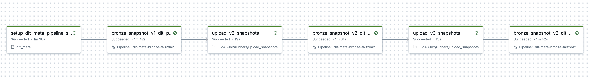

 # [DLT-META](https://github.com/databrickslabs/dlt-meta) DEMOs
 1. [DAIS 2023 DEMO](#dais-2023-demo): Showcases DLT-META's capabilities of creating Bronze and Silver pipelines with initial and incremental mode automatically.
 2. [Databricks Techsummit Demo](#databricks-tech-summit-fy2024-demo): 100s of data sources ingestion in bronze and silver pipelines automatically.
 3. [Append FLOW Autoloader Demo](#append-flow-autoloader-file-metadata-demo): Write to same target from multiple sources using [dlt.append_flow](https://docs.databricks.com/en/delta-live-tables/flows.html#append-flows)  and adding [File metadata column](https://docs.databricks.com/en/ingestion/file-metadata-column.html)
 4. [Append FLOW Eventhub Demo](#append-flow-eventhub-demo): Write to same target from multiple sources using [dlt.append_flow](https://docs.databricks.com/en/delta-live-tables/flows.html#append-flows)  and adding [File metadata column](https://docs.databricks.com/en/ingestion/file-metadata-column.html)
 5. [Silver Fanout Demo](#silver-fanout-demo): This demo showcases the implementation of fanout architecture in the silver layer.
 6. [Apply Changes From Snapshot Demo](#apply-changes-from-snapshot-demo): This demo showcases the implementation of ingesting from snapshots in bronze layer
7. [Lakeflow Declarative Pipelines Sink Demo](#lakeflow-declarative-pipelines-sink-demo): This demo showcases the implementation of write to external sinks like delta and kafka
8. [DAB Demo](#dab-demo): This demo showcases how to use Databricks Assets Bundles with dlt-meta

The source argument is optional for the demos.


# DAIS 2023 DEMO
## [DAIS 2023 Session Recording](https://www.youtube.com/watch?v=WYv5haxLlfA)
This Demo launches Bronze and Silver pipelines with following activities:
- Customer and Transactions feeds for initial load
- Adds new feeds Product and Stores to existing Bronze and Silver DLT pipelines with metadata changes.
- Runs Bronze and Silver pipeline for incremental load for CDC events

### Steps:
1. Launch Command Prompt

2. Install [Databricks CLI](https://docs.databricks.com/dev-tools/cli/index.html)

3. ```commandline
    git clone https://github.com/databrickslabs/dlt-meta.git
    ```

4. ```commandline
    cd dlt-meta
    ```

5. Set python environment variable into terminal
    ```commandline
    dlt_meta_home=$(pwd)
    ```

    ```commandline
    export PYTHONPATH=$dlt_meta_home
    ```

6. ```commandline
    python demo/launch_dais_demo.py --uc_catalog_name=<<uc catalog name>> --profile=<<DEFAULT>>
    ```
    - uc_catalog_name : Unity catalog name
    - you can provide `--profile=databricks_profile name` in case you already have databricks cli otherwise command prompt will ask host and token.

    

# Databricks Tech Summit FY2024 DEMO:
This demo will launch auto generated tables(100s) inside single bronze and silver pipeline using dlt-meta.

1. Launch Command Prompt

2. Install [Databricks CLI](https://docs.databricks.com/dev-tools/cli/index.html)

3. ```commandline
    git clone https://github.com/databrickslabs/dlt-meta.git
    ```

4. ```commandline
    cd dlt-meta
    ```

5. Set python environment variable into terminal
    ```commandline
    dlt_meta_home=$(pwd)
    ```

    ```commandline
    export PYTHONPATH=$dlt_meta_home
    ```

6. ```commandline
    python demo/launch_techsummit_demo.py --uc_catalog_name=<<uc catalog name>> --profile=<<DEFAULT>>
    ```
    - uc_catalog_name : Unity catalog name
    - you can provide `--profile=databricks_profile name` in case you already have databricks cli otherwise command prompt will ask host and token

    


# Append Flow Autoloader file metadata demo:
This demo will perform following tasks:
- Read from different source paths using autoloader and write to same target using append_flow API
- Read from different delta tables and write to same silver table using append_flow API
- Add file_name and file_path to target bronze table for autoloader source using [File metadata column](https://docs.databricks.com/en/ingestion/file-metadata-column.html)

1. Launch Command Prompt

2. Install [Databricks CLI](https://docs.databricks.com/dev-tools/cli/index.html)

3. ```commandline
    git clone https://github.com/databrickslabs/dlt-meta.git
    ```

4. ```commandline
    cd dlt-meta
    ```

5. Set python environment variable into terminal
    ```commandline
    dlt_meta_home=$(pwd)
    ```

    ```commandline
    export PYTHONPATH=$dlt_meta_home
    ```

6. ```commandline
    python demo/launch_af_cloudfiles_demo.py --uc_catalog_name=<<uc catalog name>> --source=cloudfiles --profile=<<DEFAULT>>
    ```
    - uc_catalog_name : Unity Catalog name
    - you can provide `--profile=databricks_profile name` in case you already have databricks cli otherwise command prompt will ask host and token


# Append Flow Eventhub demo:
- Read from different eventhub topics and write to same target tables using append_flow API

### Steps:
1. Launch Command Prompt

2. Install [Databricks CLI](https://docs.databricks.com/dev-tools/cli/index.html)

3. ```commandline
    git clone https://github.com/databrickslabs/dlt-meta.git
    ```

4. ```commandline
    cd dlt-meta
    ```
5. Set python environment variable into terminal
    ```commandline
    dlt_meta_home=$(pwd)
    ```
    ```commandline
    export PYTHONPATH=$dlt_meta_home
    ```
6. Eventhub
- Needs eventhub instance running
- Need two eventhub topics first for main feed (eventhub_name) and second for append flow feed (eventhub_name_append_flow)
- Create databricks secrets scope for eventhub keys
    - ```
            commandline databricks secrets create-scope eventhubs_dltmeta_creds
        ```
    - ```commandline
            databricks secrets put-secret --json '{
                "scope": "eventhubs_dltmeta_creds",
                "key": "RootManageSharedAccessKey",
                "string_value": "<<value>>"
                }'
        ```
- Create databricks secrets to store producer and consumer keys using the scope created in step 2

- Following are the mandatory arguments for running EventHubs demo
    - uc_catalog_name : unity catalog name e.g. ravi_dlt_meta_uc
    - eventhub_namespace: Eventhub namespace e.g. dltmeta
    - eventhub_name : Primary Eventhubname e.g. dltmeta_demo
    - eventhub_name_append_flow: Secondary eventhub name for appendflow feed e.g. dltmeta_demo_af
    - eventhub_producer_accesskey_name: Producer databricks access keyname e.g. RootManageSharedAccessKey
    - eventhub_consumer_accesskey_name: Consumer databricks access keyname e.g. RootManageSharedAccessKey
    - eventhub_secrets_scope_name: Databricks secret scope name e.g. eventhubs_dltmeta_creds
    - eventhub_port: Eventhub port

7. ```commandline
    python3 demo/launch_af_eventhub_demo.py --uc_catalog_name=<<uc catalog name>> --eventhub_name=dltmeta_demo --eventhub_name_append_flow=dltmeta_demo_af --eventhub_secrets_scope_name=dltmeta_eventhub_creds --eventhub_namespace=dltmeta --eventhub_port=9093 --eventhub_producer_accesskey_name=RootManageSharedAccessKey --eventhub_consumer_accesskey_name=RootManageSharedAccessKey --eventhub_accesskey_secret_name=RootManageSharedAccessKey --profile=<<DEFAULT>>
    ```

  


# Silver Fanout Demo
- This demo will showcase the onboarding process for the silver fanout pattern.
    - Run the onboarding process for the bronze cars table, which contains data from various countries.
    - Run the onboarding process for the silver tables, which have a `where_clause` based on the country condition specified in [silver_transformations_cars.json](https://github.com/databrickslabs/dlt-meta/blob/main/demo/conf/silver_transformations_cars.json).
    - Run the Bronze pipeline which will produce cars table.
    - Run Silver pipeline, fanning out from the bronze cars table to country-specific tables such as cars_usa, cars_uk, cars_germany, and cars_japan.

### Steps:
1. Launch Command Prompt

2. Install [Databricks CLI](https://docs.databricks.com/dev-tools/cli/index.html)

3. ```commandline
    git clone https://github.com/databrickslabs/dlt-meta.git
    ```

4. ```commandline
    cd dlt-meta
    ```
5. Set python environment variable into terminal
    ```commandline
    dlt_meta_home=$(pwd)
    ```
    ```commandline
    export PYTHONPATH=$dlt_meta_home
    ```

6. Run the command 
    ```commandline
        python demo/launch_silver_fanout_demo.py --source=cloudfiles --uc_catalog_name=<<uc catalog name>> --profile=<<DEFAULT>>
    ```

    - you can provide `--profile=databricks_profile name` in case you already have databricks cli otherwise command prompt will ask host and token.

    - - 6a. Databricks Workspace URL:
    - - Enter your workspace URL, with the format https://<instance-name>.cloud.databricks.com. To get your workspace URL, see Workspace instance names, URLs, and IDs.

    - - 6b. Token:
        - In your Databricks workspace, click your Databricks username in the top bar, and then select User Settings from the drop down.

        - On the Access tokens tab, click Generate new token.

        - (Optional) Enter a comment that helps you to identify this token in the future, and change the token’s default lifetime of 90 days. To create a token with no lifetime (not recommended), leave the Lifetime (days) box empty (blank).

        - Click Generate.

        - Copy the displayed token

        - Paste to command prompt

    
    
    

# Apply Changes From Snapshot Demo
  - This demo will perform following steps
    - Showcase onboarding process for apply changes from snapshot pattern([snapshot-onboarding.template](https://github.com/databrickslabs/dlt-meta/blob/main/demo/conf/snapshot-onboarding.template))
    - Run onboarding for the bronze stores and products tables, which contains data snapshot data in csv files.
    - Create source delta table for products
    - Run Bronze Pipeline to load initial snapshot for stores(LOAD_1.csv) and products delta table
    - Run Silver Pipeline to ingest bronze data using apply_changes_from_snapshot API
    - Upload incremental snapshot LOAD_2.csv version=2 for stores and load products delta table for next snapshot
    - Run Bronze Pipeline to load incremental snapshot (LOAD_2.csv). Products is scd_type=2 so updated records will expired and added new records with version_number. Stores is scd_type=1 so in case records missing for scd_type=1 will be deleted.
    - Run Silver Pipeline to ingest bronze data using apply_changes_from_snapshot API
    -  Upload incremental snapshot LOAD_3.csv version=2 for stores and load products delta table for next snapshot
    - Run Bronze Pipeline to load incremental snapshot (LOAD_2.csv). Products is scd_type=2 so updated records will expired and added new records with version_number. Stores is scd_type=1 so in case records missing for scd_type=1 will be deleted.
    - Run Silver Pipeline to ingest bronze data using apply_changes_from_snapshot API
### Steps:
1. Launch Command Prompt

2. Install [Databricks CLI](https://docs.databricks.com/dev-tools/cli/index.html)

3. ```commandline
    git clone https://github.com/databrickslabs/dlt-meta.git 
    ```

4. ```commandline
    cd dlt-meta
    ```
5. Set python environment variable into terminal
    ```commandline
    dlt_meta_home=$(pwd)
    ```
    ```commandline
    export PYTHONPATH=$dlt_meta_home

6. Run the command 
    ```commandline
    python demo/launch_acfs_demo.py --uc_catalog_name=<<uc catalog name>> --profile=<<DEFAULT>>
    ```
    

# Lakeflow Declarative Pipelines Sink Demo
  - This demo will perform following steps
    - Showcase onboarding process for dlt writing to external sink pattern
    - Run onboarding for the bronze iot events.
    - Publish test events to kafka topic
    - Run Bronze Lakeflow Declarative Pipelines which will read from kafka source topic and write to
        - events delta table into uc
        - create quarantine table as per data quality expectations
        - writes to external kafka topics
        - writes to external dbfs location as external delta sink
### Steps:
1. Launch Command Prompt

2. Install [Databricks CLI](https://docs.databricks.com/dev-tools/cli/index.html)

3. ```commandline
    git clone https://github.com/databrickslabs/dlt-meta.git 
    ```

4. ```commandline
    cd dlt-meta
    ```
5. Set python environment variable into terminal
    ```commandline
    dlt_meta_home=$(pwd)
    ```
    ```commandline
    export PYTHONPATH=$dlt_meta_home
    ```

6. Optional: if you are using secrets for kafka. Create databricks secrets scope for source and sink kafka using below command
     ```commandline 
    databricks secrets create-scope <<name>>
     ```
     ```commandline
    databricks secrets put-secret --json '{
        "scope": "<<name>>",
        "key": "<<keyname>>",
        "string_value": "<<value>>"
        }'
     ```

7. Run the command 
    ```commandline
    python demo/launch_dlt_sink_demo.py --uc_catalog_name=<<uc_catalog_name>> --source=kafka --kafka_source_topic=<<kafka source topic name>>>> --kafka_sink_topic=<<kafka sink topic name>> --kafka_source_servers_secrets_scope_name=<<kafka source servers secret name>> --kafka_source_servers_secrets_scope_key=<<kafka source server secret scope key name>> --kafka_sink_servers_secret_scope_name=<<kafka sink server secret scope key name>> --kafka_sink_servers_secret_scope_key=<<kafka sink servers secret scope key name>> --profile=<<DEFAULT>>
    ```
    
    
    


# DAB Demo
This demo showcases how to use Databricks Asset Bundles (DABs) with DLT-Meta for the following features:

* Deploying Bronze, Silver, and Silver Fanout jobs & pipelines
* Running pipelines in both Dev and Prod modes
* Adding custom columns and metadata to Bronze tables
* Creating HashKeys on selected deterministic columns
* Implementing SCD Type 1 to Silver tables
* Applying expectations to filter data in Silver tables
### Steps:
1. Launch Command Prompt

2. Install [Databricks CLI](https://docs.databricks.com/dev-tools/cli/index.html)

3. ```commandline
    git clone https://github.com/databrickslabs/dlt-meta.git
    ```

4. ```commandline
    cd dlt-meta
    ```
5. Set python environment variable into terminal
    ```commandline
    dlt_meta_home=$(pwd)
    ```
    ```commandline
    export PYTHONPATH=$dlt_meta_home
    ```

6. Run the command: Below command will generate DAB related files , create dlt-meta schemas and upload files to volumes
    ```commandline
        python demo/generate_dabs_resources.py --source=cloudfiles --uc_catalog_name=<<uc catalog name>> --profile=<<DEFAULT>>
    ```

    - you can provide `--profile=databricks_profile name` in case you already have databricks cli otherwise command prompt will ask host and token.

    - - 6a. Databricks Workspace URL:
    - - Enter your workspace URL, with the format https://<instance-name>.cloud.databricks.com. To get your workspace URL, see Workspace instance names, URLs, and IDs.

    - - 6b. Token:
        - In your Databricks workspace, click your Databricks username in the top bar, and then select User Settings from the drop down.

        - On the Access tokens tab, click Generate new token.

        - (Optional) Enter a comment that helps you to identify this token in the future, and change the token’s default lifetime of 90 days. To create a token with no lifetime (not recommended), leave the Lifetime (days) box empty (blank).

        - Click Generate.

        - Copy the displayed token

        - Paste to command prompt
7. ``` commandline
        cd demo/dabs
   ```
8. ``` commandline
        databricks bundle validate --profile=<<>>
    ```
9. ``` commandline
        databricks bundle deploy --target dev --profile=<<>>
    ```    
10. ``` commandline
        databricks bundle run onboard_people -t dev --profile=<<>>
    ```  
11. ``` commandline
        databricks bundle run execute_pipelines_people -t dev --profile=<<>>
    ```      