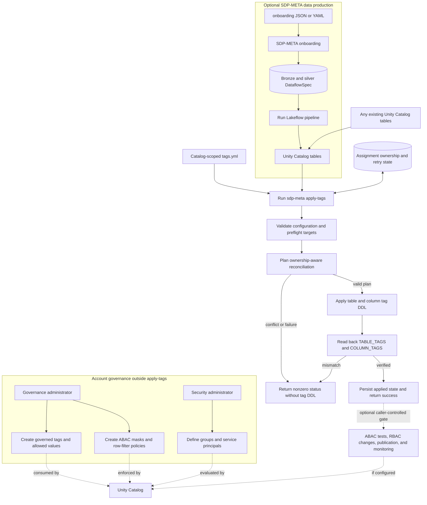
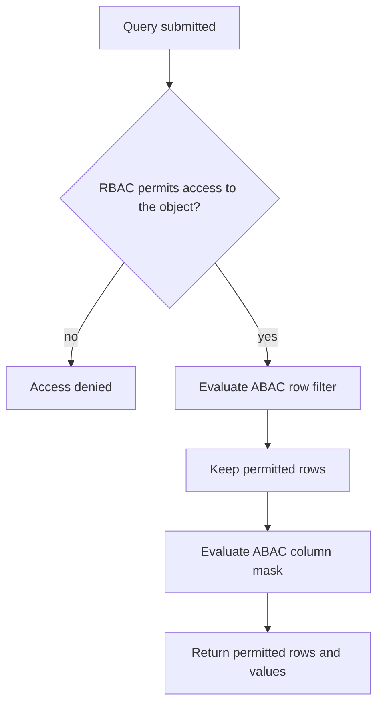
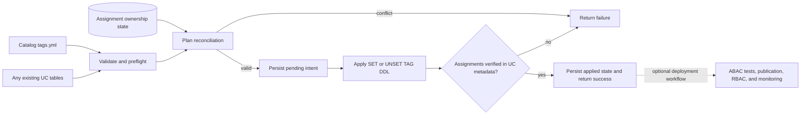

# Unity Catalog governance

SDP-META keeps pipeline metadata, tag assignments, and Unity Catalog policy
administration separate. This prevents onboarding from becoming a governance
database and allows the same tag applier to govern any existing Unity Catalog
table.

## End-to-end governance lifecycle



`onboarding.yml` and `tags.yml` are independent inputs. Onboarding produces
DataflowSpec records; it does not persist tag assignments. `apply-tags` reads
the catalog-scoped YAML directly and uses a Delta state table only for
assignment ownership and retry recovery. Existing Unity Catalog tables do not
need to originate from SDP-META.

## Simplified lifecycle

```text
1. Prepare Unity Catalog prerequisites
   Create governed tags, allowed values, and assignment permissions outside apply-tags

2. Author assignment desired state
   Create one catalog-scoped tags.yml; onboarding metadata remains independent

3. Ensure target objects exist
   Use tables created by SDP-META or any other Unity Catalog data producer

4. Preview reconciliation
   Run apply-tags with --dry-run and resolve ownership conflicts

5. Apply assignments
   Run apply-tags with --tags-file and --state-table

6. Verify assignments
   apply-tags reads back TABLE_TAGS and COLUMN_TAGS and returns success or failure

7. Run optional deployment controls
   The caller may test ABAC behavior, change RBAC, publish objects, or emit alerts

8. Enforce at query time
   Unity Catalog RBAC controls reachability; configured ABAC policies filter and mask

9. Reconcile or monitor again when scheduled
   Scheduling and continuous monitoring are external to apply-tags
```

## Query-time control sequence



RBAC determines whether a principal can reach the catalog object. ABAC then
determines which rows and values that authorized principal can see. These
checks are performed by Unity Catalog. SDP-META assigns tags that separately
provisioned ABAC policies may consume.

## Tag assignment and optional deployment gate



`apply-tags` stops at assignment verification and communicates the result
through its exit status. A deployment workflow may use that status as one input
to a fail-closed publication gate, but the tagging command does not publish
objects, modify consumer RBAC, execute ABAC tests, or start monitoring.

## Implementation boundary

The packaged tagging feature currently implements:

- optional `tags.yml` skeleton generation from SDP-META onboarding metadata;
- catalog-scoped YAML validation and target preflight;
- ownership-aware table and column tag reconciliation;
- read-back verification through `TABLE_TAGS` and `COLUMN_TAGS`;
- retry state and non-destructive handling of externally managed tags;
- public Python `apply_tags()` API plus CLI, wheel-task, and DAB execution
  surfaces.

The following are governance workflow responsibilities, not actions performed
automatically by `apply-tags`:

- creating groups, governed-tag definitions, or ABAC policies;
- executing authorized and unauthorized ABAC behavior tests;
- granting or revoking consumer RBAC;
- moving objects between protected and published schemas;
- continuous schema-classification monitoring.

Those steps must be implemented by the deployment workflow if fail-closed
publication is required.

Key principles:

- `tags.yml` is the only desired-state source for assignments.
- One file governs one catalog and may include multiple schemas.
- Existing externally managed assignments are preserved.
- A deployment workflow may use tagging and policy verification to gate
  publication.
- Account-level security and governance bootstrap remains separate from
  pipeline runtime permissions.

Continue with [catalog-scoped tags](./catalog-scoped-tags.md) and the
[tagging guide](../../guides/governance/unity-catalog-tagging.md). To run the
complete notebook workflow, use the
[interactive governance tagging demo](https://github.com/databrickslabs/dlt-meta/tree/main/demo/governance-tagging).
