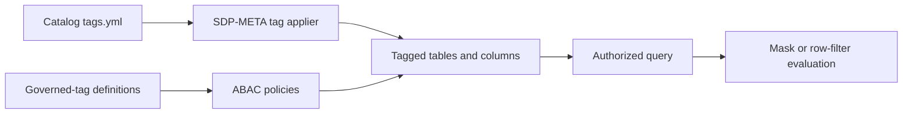

# Governed tags and ABAC

The tag applier assigns approved attributes to Unity Catalog tables and
columns. Unity Catalog ABAC policies consume those attributes to apply column
masks and row filters.

## Responsibility boundary

- Security creates account groups and service principals.
- Governance creates governed-tag definitions, allowed values, functions, and
  ABAC policies.
- Data owners approve catalog-specific assignments.
- The SDP-META runtime identity receives `ASSIGN` and `APPLY TAG`, but not
  governed-tag `MANAGE`.

## Recommended order

1. Create security groups and runtime identities.
2. Create governed-tag definitions and allowed values.
3. Grant `MANAGE` to governance administrators.
4. Grant `ASSIGN` to the tag-applier identity.
5. Create policy functions and ABAC policies.
6. Apply the reviewed catalog `tags.yml`.
7. Verify assignments and policy behavior with authorized and unauthorized
   test principals.
8. Publish governed objects only after verification succeeds.

Example automation manifests are under
`examples/governance/automation-templates/`.

See the Databricks documentation for current
[ABAC policy syntax](https://docs.databricks.com/aws/en/data-governance/unity-catalog/abac/policies).
